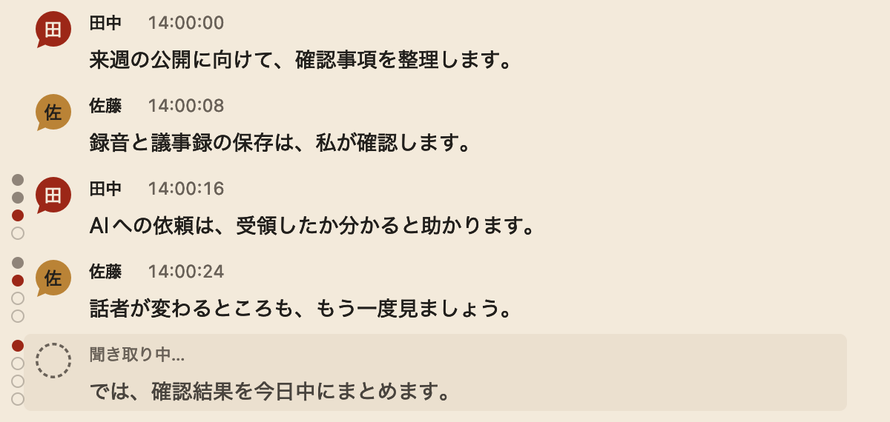

<p align="center">
  
</p>

# KIKIGAKI

会議の発話を聴いて、話者付きでリアルタイムに文字起こしし、Markdownで残すmacOSアプリです。

フクロウの顔を2つの吹き出しで表したロゴが目印。朱色と生成りに、金のくちばしを添えています。

## できること

- マイクの音声を端末内で文字起こし。速報を先に出し、高精度の結果で静かに差し替え
- 最大4話者の判別と、話者名の編集・手動統合
- 会議ごとの話者判別切替。無効時は文字起こしの確定後すぐに発言として表示
- 発話ごとの確定状況を、行の左のゲージで表示
- 別会議の声など小音量の発話を、しきい値で薄く除外
- 録音の一時停止・再開
- URLや補足を固定名「手入力」で会話へ投稿
- 会議ごとのMarkdown保存と、任意のWAV保存
- 「会話をコピー」から、会話ファイルの参照と必要範囲をAIへ受け渡し
- herdr上のCodex・Claude Codeを会議へ参加させ、依頼・返事・定期の自動送信を同じ画面で扱う
- AIが書いた議事録を右ペインでプレビュー。目次・検索・変更箇所の強調・Mermaid・数式・Wikiリンクに対応

話者判別は推定です。必要に応じて書き起こしと話者を確認してください。

## 動作環境

- macOS 26以降
- マイクへのアクセス許可
- 初回セットアップ時のネットワーク接続

文字起こしにはApple Speech、話者判別にはFluidAudioのSortformerを使います。必要なモデル・言語アセットは自動でダウンロードします。

- 話者判別モデル: 有効な設定での起動時か有効へ切り替えたときに、Hugging Faceから約241 MBを取得します。以後は保存済みモデルを再利用し、無効設定での起動時は取得・読み込みを行いません。
- Apple Speechの日本語アセット: 未導入の場合、初めて録音を開始するときに別途取得します。容量は上記に含みません。

取得が完了するまで、録音開始は準備待ちになります。

## インストール

Homebrewで導入します。

```bash
brew install --cask tadashi-aikawa/tap/kikigaki
```

更新は次のコマンドです。

```bash
brew upgrade --cask kikigaki
```

自己署名(未公証)のアプリです。初回起動がブロックされた場合は、システム設定 → プライバシーとセキュリティ → 「このまま開く」で許可してください。

配布物は [Releases](https://github.com/tadashi-aikawa/kikigaki/releases) の `KIKIGAKI-<バージョン>.zip` からも取得できます。

### ソースからビルドする場合

macOS 26のSDKとSwift 6に対応するXcodeまたはCommand Line Toolsを用意し、以下を実行します。

```bash
git clone https://github.com/tadashi-aikawa/kikigaki.git
cd kikigaki
./scripts/make-app.sh
open .build/KIKIGAKI.app
```

作成された `.build/KIKIGAKI.app` をFinderで「アプリケーション」へコピーすれば、以後は通常のアプリとして起動できます。

この方法ではSkillのリンクを張らないので、会議へAIを参加させる場合は使うCLIのSkill置き場へ自分で配置してください。

```bash
ln -s "$PWD/skills/kikigaki" ~/.claude/skills/kikigaki
ln -s "$PWD/skills/kikigaki" ~/.codex/skills/kikigaki
```

## 起動と基本操作

メニューバーのフクロウから「開く」で書き起こしウィンドウを出し、録音を開始すると発話が順に表示されます。停止すると、既定では `~/Documents/KIKIGAKI` にMarkdownを保存します。

### 発話行の左のゲージ

録音中、発話行の左に縦に並ぶ丸は、その発話がどこまで確定したかを表します。認識の正しさを保証するものではなく、確定した文字でも話者は誤ることがあります。

<p align="center">
  
</p>

| 丸の見た目 | 意味 |
|---|---|
| 灰の塗り | 通過した段 |
| 朱の塗り | いま居る段 |
| 輪郭だけ | まだ先の段 |

段は上から順に進みます。話者判別が有効な会議は4段、無効な会議は3段目までです。

1. **暫定**: 聞き取り中。破線のアバターと「聞き取り中…」の行で、文字はまだ変わります
2. **速報の確定**: 速報エンジンの文字が確定しました。高精度側の結果で後から差し替わることがあります
3. **高精度の確定**: 高精度エンジンの文字が確定しました。話者判別が無効な会議はここでゲージが消えます
4. **話者固定**: 30秒より古い発話の話者判定を凍結しました。ここに到達するとゲージが消えます

丸にカーソルを合わせると段名が出ます。録音を停止すると全行のゲージが消え、話者は会議全体で再判定します。詳しくは [発話行のゲージ](docs/utterance-progress.md) を参照してください。

### 話者判別と小音量の除外

「録音を開始」を押すと、その会議だけの指定を決めるシートが出ます。話者判別・議事録・AIへの自動送信を決めてから始められ、既定値はすべて前回の値なので、何も触らずReturnでも始められます。取消を押すと何も始まりません。詳しくは [録音開始シート](docs/start-sheet.md) を参照してください。

話者判別はこのシートで切り替えます。初期値は有効で、選択はアプリ再起動後も記憶します。録音を始めると変更できません。無効時は全員を「発言」として扱い、文字起こしの確定後に話者の判定を待たず表示します。聞き取り中の文字は引き続き暫定表示し、文末や無音でフキダシを分けます。詳しくは [話者判別の切替](docs/diarization-toggle.md) を参照してください。

話者名かアバターをクリックすると、その枡の名前を台帳の候補や自由入力で変えられます。同じ人が2つの枡に割れたときは、人型ボタンの使用枠から統合先を選べます。詳しくは [話者の手動統合](docs/speaker-mapping.md) を参照してください。

隣の会議の声など小さな声が混ざるときは、「話者」ポップアップのスイッチとスライダーで小音量の発話を除外できます。除外した行は薄く残り、コピーとAI送信から外れます。初回はOFFで、しきい値は−45 dBFSです。詳しくは [小音量発話の除外](docs/audio-exclusion.md) を参照してください。

録音中・一時停止中は、本文下の「会話に書き込む… · ⌘Enterで投稿」から⌘Enterで手入力を投稿できます。素のEnter・Shift+Enterでは投稿も改行もしません。IME変換中のEnterは確定だけを行います。複数行の貼り付けは1行へまとめ、Escは下書きを残してフォーカスを外します。手入力のURLはクリックで開けます。投稿は声の行の間に入り、Markdown・コピー・AI送信にも残ります。一時停止中の投稿時刻も再開後に変わりません。

録音の開始・停止・一時停止はウィンドウのボタンかメニューバーから操作します。AIへの手動実行はフッター左端のロボットのメニューからです。グローバルショートカットはありません。

## 設定

`~/.config/kikigaki/config.toml` で設定します。すべて省略可能です。

```toml
outputDir = "~/Documents/KIKIGAKI"
saveRecording = false
```

WAVも残す場合は `saveRecording = true` にします。

AIへ会話を渡す手順は [AIへの受け渡し](docs/ai-handoff.md)、その他の設定と開発手順は [CLAUDE.md](CLAUDE.md) を参照してください。

### 会議へAIを参加させる

herdrとCodexまたはClaude Codeを導入します。AIが会話を受け取るための [kikigaki Skill](skills/kikigaki/SKILL.md) はアプリに同梱してあり、Homebrewでの導入時に `~/.claude/skills/kikigaki` と `~/.codex/skills/kikigaki` へリンクします。リポジトリをcloneして自分でリンクを張る必要はありません。

- 同名のファイルが既にある場合は上書きせず、導入時に警告だけを出します。自分で置いたSkillをそのまま使い続けられます
- 同梱版へ切り替えるときは、そのファイルを消してから `brew reinstall --cask kikigaki` を実行してください
- `brew uninstall --cask kikigaki` では、KIKIGAKI.appを指すリンクだけを外します

設定へ次を追加すると、次の会議から「AIへ…」が使えます。`[ai]` を省略した場合は無効です。

```toml
[ai]
cli = "codex" # Claude Codeなら "claude"
address = "迅雷へ"
notifySound = false
# 自動送信シートの初期値。設定だけでは開始しません
autoPrompt = "会議の決定事項と担当・期限をMarkdown議事録へ更新してください" # 省略時は空欄
autoIntervalMinutes = 3 # 1〜60分、省略時は3分
# CLIとherdrはPATHのほか ~/.local/bin・miseのshims・Homebrewを探します。見つからないときだけ絶対パスを指定します
# command = "/opt/homebrew/bin/codex"
# herdrCommand = "/opt/homebrew/bin/herdr"
```

初回の送信で専用herdrペインが作られます。固定の作業場所でも最初は利用者が一度ペインで信頼確認を承認してください。送信欄は空欄なら直近の声を送り、入力した場合は入力文を優先します。返事と確認は書き起こし中の展開できる印へ届き、会議Markdownにも残ります。確認の印の「返答する」から続けられます。

録音停止後も返事を回収します。次の会議への返事と混ぜず、旧会議の返事は元のMarkdownへ保存します。保存に失敗したときは「保存を再試行」を使えます。アプリ再起動後は未完了会議の返送を回収しますが、AIセッションの再接続や送信の再試行はしません。

モデルや作業場所、追加引数の設定は [AI参加者の設計](docs/ai-participant.md#設定) を参照してください。声の作業依頼も扱う会議参加モードと、従来の手動コピーでは操作の許可範囲が異なります。

議事録の保存先は依頼文に従い、人が指定した書き先がenvelopeの `participant.minutes_path` にあればそちらを使います。作成・更新後は同梱CLIの `minutes` でアプリへパスを通知します。通知したパスは別のAIの書き先へ伝播しません。既定の議事録パスや会議ごとの自動生成はありません。ヘッダーの「議事録」か「表示」メニューで右ペインを開けます。パス欄はReturnで確定し、Escapeで取り消します。パス欄にフォーカスすると最近表示したファイルの履歴が出ます。指定ファイルの更新は自動で表示し、AIの依頼中に変わった箇所は淡い紫で残します。右上の「目次」で見出しへ移動でき、⌘Fで本文を検索できます。ObsidianのVault内にある議事録では `[[ノート]]` がリンクになり、クリックでObsidianの該当ノートを開きます。×ボタンは表示中の議事録を閉じ、ペインは開いたままです。受け渡しの詳細は [議事録プレビューの設計](docs/minutes-preview.md)、描画できる記法は [議事録の描画と検索](docs/minutes-rendering.md) を参照してください。

`[[ai]]` を複数書くと、送信ごとに宛先のAIを選べます。会議の前に「AIセッションを準備…」で起こしておき、録音開始時に枠へ紐づけることもできます。詳しくは [AI設定の複数プロファイル](docs/ai-profiles.md) を参照してください。

Codexの起動では `outputDir` を書き込み許可へ追加します。任意のパス指定で無条件の許可は増えませんが、保存先外への書き込みはCLIの承認の仕組みに委ねられ、herdrのペインで承認すれば保存できます。拒否されたときだけ `work_failed` になります。追加許可によって保存先内の全会議の管理ファイルも書き換え可能になる点は、[設定と受け入れたリスク](CLAUDE.md#設定) を参照してください。Claudeの承認待ちはherdrのペインで確認します。

### 会話を定期的にAIへ送る

録音中・一時停止中にフッターの「自動送信…」を開き、毎回送る依頼、間隔、作業許可を設定して「開始」を押します。既定は3分で、開始から指定間隔後に最初の送信を行います。手動の「AIへ…」と同じAIセッションを使い、前回の受領から変更がない回や返事待ちの回はスキップします。

実行中は状態行に次の送信時刻が出ます。「自動送信を停止」は録音を続けたまま自動送信を止めます。「録音停止時に最後の1回を送る」は既定ONで、録音の最終処理と保存が成功し、変更があれば最後に1回送ります。返事待ちなら到着後まで保留し、保留中も「自動送信を停止」で取りやめられます。

自動の返事は「自動」の印付きで畳まれ、未読強調や通知音はありません。確認質問・失敗は通常どおり表示します。自動送信は新しい会議やアプリ再起動で開始し直してください。詳しくは [定期自動送信](docs/ai-scheduled.md) を参照してください。

## ロゴ

共通の元画像は [Resources/kikigaki.png](Resources/kikigaki.png) です。READMEとアプリアイコンはこの画像を使います。

元画像を更新したら、次のコマンドで配布用アイコンを再生成します。

```bash
bash scripts/make-icon.sh
```

生成した `Resources/kikigaki.icns` はアプリの組み立て時に同梱されます。

owlery・parliamentへの反映手順と制作記録は [ロゴの管理](docs/logo.md) を参照してください。
