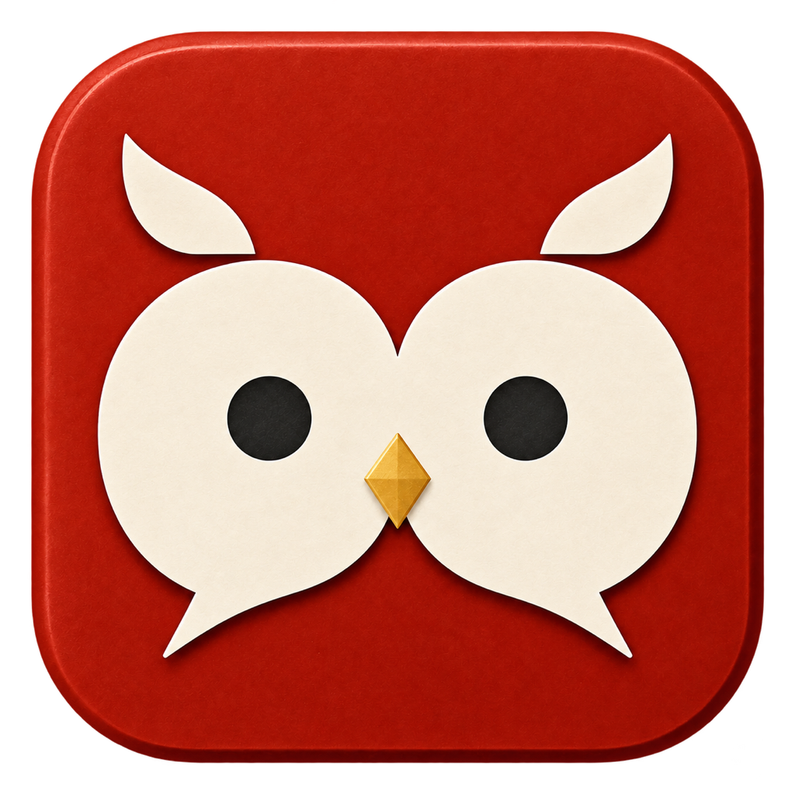

<p align="center">
  
</p>

# KIKIGAKI

会議の発話を聴いて、話者付きでリアルタイムに文字起こしし、Markdownで残すmacOSアプリです。

フクロウの顔を2つの吹き出しで表したロゴが目印。朱色と生成りに、金のくちばしを添えています。

## できること

- マイクの音声を端末内で文字起こし
- 最大4話者の判別と、話者名の編集
- 録音の一時停止・再開
- 会議ごとのMarkdown保存と、任意のWAV保存
- 「会話をコピー」から、会話ファイルの参照と必要範囲をAIへ受け渡し

話者判別は推定です。必要に応じて書き起こしと話者を確認してください。

## 動作環境

- macOS 26以降
- マイクへのアクセス許可
- 初回セットアップ時のネットワーク接続

文字起こしにはApple Speech、話者判別にはFluidAudioのSortformerを使います。必要なモデル・言語アセットは自動でダウンロードします。

- 話者判別モデル: 初回のアプリ起動直後にHugging Faceから約241 MBを取得します。以後は保存済みモデルを再利用します。
- Apple Speechの日本語アセット: 未導入の場合、初めて録音を開始するときに別途取得します。容量は上記に含みません。

取得が完了するまで、録音開始は準備待ちになります。

## ビルドと起動

Swift 6対応の開発環境で、リポジトリのルートから実行します。

```bash
./scripts/make-app.sh
open .build/KIKIGAKI.app
```

メニューバーから録音を開始すると、書き起こしウィンドウへ発話が順に表示されます。停止すると、既定では `~/Documents/KIKIGAKI` にMarkdownを保存します。

| 操作 | 既定のショートカット |
|---|---|
| 開始・停止 | Control + Option + Command + K |
| 一時停止・再開 | Control + Option + Command + P |

## 設定

`~/.config/kikigaki/config.toml` で設定します。すべて省略可能です。

```toml
outputDir = "~/Documents/KIKIGAKI"
saveRecording = false
```

WAVも残す場合は `saveRecording = true` にします。

AIへ会話を渡す手順は [AIへの受け渡し](docs/ai-handoff.md)、その他の設定と開発手順は [CLAUDE.md](CLAUDE.md) を参照してください。

## ロゴ

共通の元画像は [Resources/kikigaki.png](Resources/kikigaki.png) です。READMEとアプリアイコンはこの画像を使います。

元画像を更新したら、次のコマンドで配布用アイコンを再生成します。

```bash
bash scripts/make-icon.sh
```

生成した `Resources/kikigaki.icns` はアプリの組み立て時に同梱されます。

owlery・parliamentへの反映手順と制作記録は [ロゴの管理](docs/logo.md) を参照してください。
