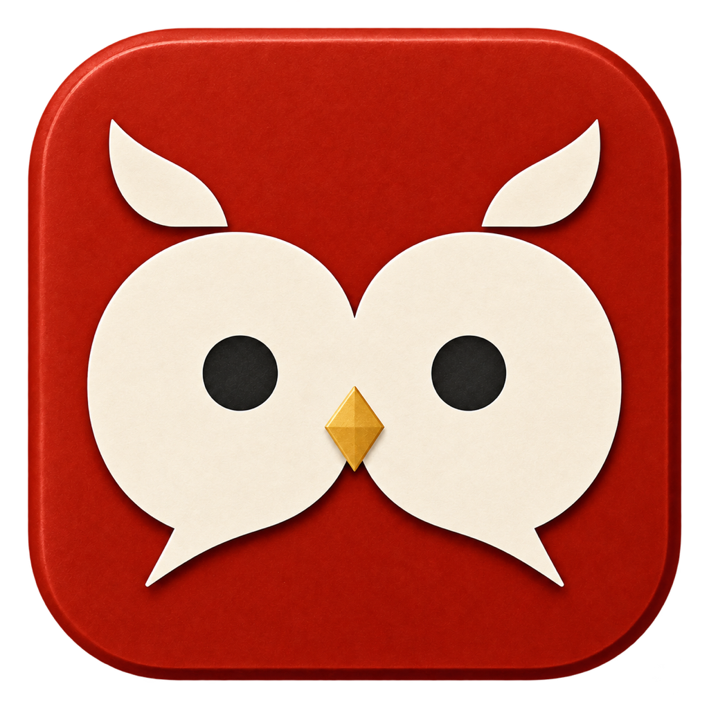

<p align="center">
  
</p>

# KIKIGAKI

会議の発話を聴いて、話者付きでリアルタイムに文字起こしし、Markdownで残すmacOSアプリです。

## できること

- マイクの音声を端末内で文字起こし
- イヤホン利用時はMacで再生中の相手の声も取り込み
- 最大8話者の判別と、話者名の編集・統合
- URLや補足、画像の手入力
- 会議ごとのMarkdown保存
- 会話をコピーして任意のAIへ受け渡し
- CodexやClaude Codeを会議へ参加させ、議事録の作成や質問への回答を依頼
- AIが書いた議事録のプレビュー

話者判別は推定です。必要に応じて書き起こしと話者を確認してください。

## 動作環境

- macOS 26以降
- マイクへのアクセス許可
- 初回のネットワーク接続
    - 話者判別モデルを約193 MB取得します
    - Apple Speechの日本語アセットが未導入の場合は、それも取得します

## インストール

```bash
brew install --cask tadashi-aikawa/tap/kikigaki
```

更新は `brew upgrade --cask kikigaki` です。

自己署名のアプリです。初回起動がブロックされた場合は、システム設定 → プライバシーとセキュリティ → 「このまま開く」で許可してください。

## 使い方

1. メニューバーのKIKIGAKIのロゴをクリックして「開く」を選びます。
2. 「録音を開始」を押し、シートで会議ごとの指定を確かめて開始します。何も変えずにReturnでも始められます。
3. 話すと、発話が話者付きで順に表示されます。半透明の行は、文字や話者が後から変わる可能性があります。
4. 停止すると、`~/Documents/KIKIGAKI` にMarkdownを保存します。

話者名をクリックすると名前を変えられます。同じ人が2人に分かれたときは、上部の人型ボタンから統合できます。

## データの行き先

音声と文字起こしは端末内で処理し、保存先も端末内です。外へ出るのは、AI参加を自分で設定して送信した内容だけです。

| 情報 | 端末内に保存 | AIサービスへ送信 | そのほかの外部へ送信 |
| --- | --- | --- | --- |
| マイクとシステム音声 | 設定時のみ | しない | しない |
| 書き起こし | する | AI参加時のみ | しない |
| 手入力と添付画像 | する | AI参加時のみ | しない |
| 議事録 | する | AI参加時のみ | しない |
| 利用状況や不具合の情報 | しない | しない | しない |

- 設定時のみ: `saveRecording = true` のときだけ、録音をWAVで残します。
- AI参加時のみ: `[[ai]]` を設定し、手動か自動で送信したときだけ、自分のMacで動くCodex・Claude Codeを経由して各サービスへ送ります。
- AI参加を使わなければ、会議の内容は外へ出ません。
- AIへ送った内容の扱いは、使うサービスの契約と設定に従います。業務で使う場合は、会議の内容を渡してよいかを先に確かめてください。
- モデルの取得ではHugging FaceとAppleへ接続します。音声や文字起こしは送りません。
- アバターや議事録に外部の画像URLを書いた場合は、その配信元へ接続します。

話者判別モデルは [Nemotron 3 Diarization](https://huggingface.co/FluidInference/nemotron-3-diarization-coreml) です。利用条件は [OpenMDW License Agreement 1.1](https://openmdw.ai/license/1-1/) で、商用利用もできます。

## 設定

`~/.config/kikigaki/config.toml` で設定します。すべて省略できます。

```toml
outputDir = "~/Documents/KIKIGAKI"
saveRecording = false # trueで録音WAVも残す
```

全キーは [設定リファレンス](docs/config.md) を参照してください。

### 会議へAIを参加させる

herdrと、CodexまたはClaude Codeが必要です。

1. AIが会話を受け取るためのSkillを導入します。

    ```bash
    /Applications/KIKIGAKI.app/Contents/Helpers/kikigaki-cli skill install
    ```

    - `~/.claude/skills/kikigaki` と `~/.codex/skills/kikigaki` へ、アプリ内のSkillを指すリンクを張ります。一度実行すれば、アプリの更新後も新しいSkillが届きます。
    - 同名のファイルが既にある場合は上書きしません。
    - `kikigaki-cli` はPATHへ追加されません。上の絶対パスで実行してください。

2. 設定へ宛先を追加します。

    ```toml
    [[ai]]
    cli = "codex" # Claude Codeなら "claude"
    address = "迅雷へ"
    autoPrompt = "会議の決定事項と担当・期限をMarkdown議事録へ更新してください"
    ```

3. 次の会議から、フッター左端のロボットのメニューで「手動実行…」と「自動実行…」が使えます。

初回の送信で専用のherdrペインが作られます。最初の一度だけ、ペインで信頼確認を承認してください。

参加したAIは、保存先フォルダの中のファイルを書き換えられます。

## 開発

ビルドと開発の手順は [CLAUDE.md](CLAUDE.md) を参照してください。

## ライセンス

[MIT License](LICENSE) です。

同梱する第三者のソフトウェアとそのライセンスは [THIRD-PARTY-NOTICES.md](THIRD-PARTY-NOTICES.md) にまとめています。
