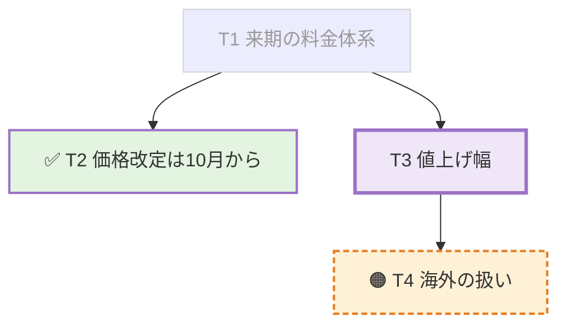

# 議論のボード

議事録と同じMarkdownファイルの指定見出しを、自動送信で更新する。手動は議事録本文、自動はボードを担当する。

## 設定と受け渡し

```toml
[[ai]]
name = "議事録とボード"
cli = "codex"
board = "## ボード"
boardLocation = "~/Documents/minutes/${yyyyMMdd_HHmmss}.md として作成し、変数は現在日時"
autoPrompt = "議事録を更新してください"
autoStart = true
autoIntervalMinutes = 1
# boardPrompt = "ボードの独自プロンプト全文"
```

- boardはMarkdown見出し1行。#は1〜6個、半角空白、見出し本文が必要。空・複数行・NULを拒否する。比較ではNFC/NFDを同一視する。
- 複数のプロファイルが同じboardを持ってよい。自動送信は会議に1つで、会議の見出しは最初の自動送信開始で固定する。同じ見出しの宛先なら、会議の途中で担当を替えても同じボードを更新できる。替えた先の自動送信は、同じ見出しの自動依頼がどの宛先かで返事待ちの間は「返事待ちでスキップ中」として待つ。依頼した宛先のペインを後片付けで閉じた後は、返事が来ないため待たない。一時的な接続の見失いでは待ちを解かない。
- board省略時は従来の動作。board無しのboardPrompt・boardLocation、空または空白だけの値、型違いはエラー。作成指示を付けたプロンプト全体も32 KiB以内に収める。
- boardLocationは任意の自由文。議事録パスが無いときの書き先の作り方をAIへ伝える。`${...}` や `~` はアプリで展開しない。任意の保存先への書き込み許可を追加する設定ではない。
- ボードの自動送信は議事録パスかboardLocationがあれば開始できる。どちらも無ければ「ボードの自動送信には議事録のパスか boardLocation が必要です」と表示して拒否する。録音開始シート、録音中の自動開始、AIScheduleSheetで同じ条件を使う。
- 自動送信は内蔵文面またはboardPromptを使う。boardPromptは全文差し替えのまま。パスが無い送信だけ共通の作成・通知指示とboardLocationを末尾に付け、通知後は付けない。autoPromptは手動シートの初期値として維持する。
- participant.board_headingは任意の文字列。明示nullを拒否する。手動にも会議の固定値を渡し、Skillでボードの見出しと配下の変更を禁止する。
- 会議Markdownの送信文は「ボードを更新(## ボード)」とこの文書への参照にする。送信した全文は固定requestに残る。

## 保存と表示

タブ名は見出し行の `(HH:MM 更新)` があれば `ボード HH:MM`、なければ `ボード` とする。

ボードの見出しは最初の自動送信開始時にai/minutes.jsonのboard_headingへ保存する。schema_versionは1で旧ファイルは省略を許す。既存のrevision比較更新を使い、対象パス・target_source・通知の到達点は変更しない。会議途中の異なる見出しへの変更は拒否する。

パス無しで作成したAIは同梱CLIの `minutes --path` で絶対パスを通知する。通知は `minutes_path` と `target_source: "ai"` に保存し、右ペインの表示先を切り替える。人の指定を表す `human_minutes_path` へはコピーしない。ボードの会議では以後の手動・自動送信に、人の指定を優先し、無ければ通知されたパスを `participant.minutes_path` として渡す。送信操作の入口で見出しとパスを固定する。ボードのない会議ではAI通知を次の書き先へ伝播しない。

人がパスを変更した場合はそちらを優先する。空欄へ戻すと通知済みパスも解除し、次のボードの送信は再びboardLocationを使う。通知の時刻順・人の操作より古い通知の除外は従来どおり。

パス欄の下に「議事録」「ボード」のタブを置く。見出しの紐づけがなく、またはファイル内に指定見出しがなければタブは出ない。議事録からボードの見出しと配下を除き、ボードには配下だけを出す。目次・検索・折りたたみ・紫の更新強調はそれぞれの描画器で保持する。Neovim・Obsidianは共通の元ファイルを開く。

設定は `board = "## ボード"` のまま、AIは毎回実時刻を確認して `## ボード(17:48 更新)` の形へ見出し行ごと更新する。見出し切り出しは設定値と完全一致する行か、直後に `(HH:MM 更新)` だけが付く行を認める。時刻は00:00〜23:59。`## ボード2` や任意の接尾辞は認めない。時刻付きでもタブの表示範囲は同じで、ボードタブは図から始まる。概要行と「論点」見出し、版数は表示しない。立場に続いて、デバッグ用の「直近の動き」を最下部へ置く。

見出し切り出しはコードフェンスとfrontmatterを除外し、次の同階層以上のATX見出しで止まる。`BoardSection.replacing` は `headingLine` を渡すと見出し行も差し替え、省略時は既存行を保つ。NFC/NFDを同一視し、差し替えた見出しのCRLFと他の節のバイト表現を保つ。AIの実編集はプロンプトとSkillの契約で制限し、アプリがAIのファイル書き込みを監査・差し戻しするものではない。

## 全体図と詳細図の仕様

- 論点数に上限を設けず、利用者が整理を頼んだときだけ図から畳む。IDは再利用しない。
- 1枚で見づらいときは、全体図と詳細図に分けられる。
    - 全体図: ボードの見出し直後に、大きな枝の起点だけを置く。
    - 詳細図: ボードより1段深い見出しの下に置く。見出しの新設はボードの節内だけに限る。
    - 例: `## ボード` 直後の全体図から、`### 料金の詳細` の詳細図へ結ぶ。
    - 例外: 第6階層のボードは詳細図用の見出しを作れないため1枚を維持する。
- 現在地のnowは、ボード全体でちょうど1つにする。
- 複数図の順序は全体図、詳細図、立場、直近の動きとする。
- 全体図の直後に、詳細図ごとの `[[#詳細図の見出し]]` を1行ずつ置く。
    - 理由: Obsidianのstrict設定ではMermaidのclickが無効になるため、リンク行を移動手段にする。
    - KIKIGAKI: Vault内外ともリンク行からボード内の見出しへ移動できる。カードのclickからも移動できる。

## 内蔵プロンプト全文

Sources/KikigakiCore/Board.swiftのBoardPrompt.builtInとテストで機械照合する。

````text
議論のボードを更新してください。「いま何を話しているか」を1画面で見せるボードです。

書き先は participant.minutes_path のファイル内の participant.board_heading です。必ず既存ファイルを読んでから、その見出し行から次の同階層以上の見出しの直前までだけを差し替えてください。他の見出しと本文は一切触りません。コードブロック内の見出しは区切りではありません。設定の見出し行と完全一致する行、または直後に (HH:MM 更新) だけが付いた行を対象にし、任意の続きは認めません。NFC/NFDの違いは同じ見出しとして扱い、他の節の改行を保ってください。見出しが無ければ末尾に見出しごと追加し、ファイルが無ければ作成してください。書き先が無ければ末尾の「書き先が無いときの作り方」に従って作成してください。その指示も無い場合、または participant.board_heading が無い場合は作業を止めて理由を返してください。

毎回、実際の現在時刻を確認し、見出し行を <participant.board_heading>(HH:MM 更新) で書き直してください。例: ## ボード(17:48 更新)。設定の見出し自体は変えません。

型はMermaid図、立場、直近の動きの順序を守ります。ボードの見出し直後からMermaid図を置き、概要行と「論点」見出しは置きません。版数は本文にも返答にも出しません。「立場」「直近の動き」はボードより1段深い見出しにし、ボードが第6階層なら太字の段落にします。



### 立場

| 論点 | タダシ | 田中 |
| --- | --- | --- |
| T3 値上げ幅 | 10%まで | 5%が上限 |

### 直近の動き

- T3 が新しく立った
- T2 が決まった

規則:

- 上の内容は型の例です。会話に無い論点・立場を足しません。聞き取れない箇所は書かず、話者の取り違えや立場が曖昧なら表へ書きません。
- ノードIDはT1から初出順に採番します。一度付けたIDを変更・再利用せず、文言を書き直してもIDを保ちます。論点の数に上限は設けません。図から論点を畳むのは、利用者が整理を頼んだときだけです。IDは再利用しません。
- 既存行の順序を保ち、変わった行だけを書き換え、新しいノードと矢印は各々の末尾へ追記します。毎回ゼロから組み直しません。flowchart TBを維持し、subgraphは使いません。
- 1枚で見づらくなったら、全体図と詳細図に分けてかまいません。全体図には、大きな枝の起点だけを置きます。
- 詳細図は、ボードより1段深い見出しの下に置きます。全体図の起点からは、click Tn "#見出し" で詳細図へ結びます。
- 詳細図の見出しは、ボードの節の中に限って作ってかまいません。
- 全体図の直後に、詳細図ごとに [[#詳細図の見出し]] のリンク行を1行ずつ置きます。KIKIGAKIではclickが効き、Obsidianではこのリンク行で移動できます。
- 図が複数あるときは、全体図、詳細図、立場、直近の動きの順に並べます。
- 配置例: ## ボード の直後に全体図と [[#料金の詳細]]、続く ### 料金の詳細 の下に詳細図を置きます。全体図には見出しを足しません。ボードが第6階層なら、詳細図用の見出しを作れないため1枚を維持します。
- ラベルは20字以内で必ず ["..."] で囲み、内部に [ ] " を入れません。状態の印に続けてIDと本文を書きます。印なしはこれから決めるもの、✅ は決まった、🟠 は保留、❌ は却下、💬 は決定対象でない前提・所感です。
- ✅ はdone、🟠 はhold、❌ はrejectedのclassを付けます。現在地(now)は、図が何枚あってもボード全体でちょうど1つです。直前の版から内容・状態・立場が動いた論点はhot、2版以上動いていないものはcoldです。now/hot/coldは同じIDへ重ねず、状態のclassより後に指定します。
- 派生関係は T1 --> T3 の矢印を追加順で並べます。
- 議事録本文に論点と対応する見出しがあれば、単独行の click Tn "#見出し" で結びます。見出しに {#id} があれば "#id" を使います。ボードの節の外に見出しを作ったり、外部URLやJavaScript callbackを指定したりしません。
- 立場の表は意見が割れている論点だけにし、全員一致と未表明は書きません。話者名は会話のまま、立場は10字以内。割れていなければ表の代わりに「まだ割れていない」と書きます。
- 直近の動きはデバッグ用として最下部に残し、3行まで。古い行は消します。

participant.minutes_path がある場合は、保存後にminutesで通知しないでください。書き先が無く指示に従って作成した場合は、保存成功後に同梱CLIの minutes --path で実際の絶対パスを通知してください。accept、progress --editing、保存、必要なminutes通知、progress --replying、reply --kind answeredの順に進め、answeredは動いた点の1〜2行だけにしてください。
````

パス無しかつboardLocationありのときは、内蔵文面・boardPromptのどちらにも空行と次の固定文面を付け、その次の行にboardLocationをそのまま付ける。BoardPrompt.locationInstructionとテストで機械照合する。

```text
書き先が無いときの作り方:
participant.minutes_path が無いので、次の指示に従って書き先を決め、ボードを含む議事録ファイルを作成してください。変数はAIが解釈してください。保存成功後、answeredの前に同梱CLIの minutes --path で実際の絶対パスを通知してください。以後は通知したファイルが participant.minutes_path として渡されます。
```

## カードから議事録へ

ボードのMermaidで単独行の `click T1 "#見出し"` または `click T1 href "#id"` を受け取る。

- ボード内に対象の見出しがあれば、その詳細図へ移動する。
- ボード内に対象が無ければ、議事録タブへ切り替えて見出しへ移動する。
- どちらも既存の見出しアンカー移動と着地強調を使う。Enter・Spaceでも移動できる。

Mermaid公式仕様ではclickはstrictで無効になるため[^click]、strict・CSP・SVGのa要素禁止は維持し、内部見出しへの指定だけを描画前に抜き出す。sanitize後のT番号に対応するノードへ、アプリの見出し移動操作だけを結び付ける。外部URL・callback・任意HTML・tooltip付き指定は対象外。許可範囲をMermaid全体へ広げないための設計である。

[^click]: [Mermaid公式: Interaction](https://mermaid.js.org/syntax/flowchart.html#interaction)

## 検証記録

検証結果と受入手順は [議論のボードの検証記録と受入手順](records/board-verification.md) に置く。

## 限界

AIは会話を読み違える。話者判別の誤りと音声認識の誤字は、そのままボードの論点名や立場に入る。ボードは会議の要約であって議事録の代わりではない。

ボードは送信から1〜2分遅れて会議を映す。送信間隔の最短は1分で、AIの往復に60〜90秒かかる。返事待ちの間のtickはスキップするため、実際の更新周期は間隔ではなくAIの応答時間で決まる。

Mermaidのノードの並びは固定できない。ノードIDと行順を保っても、辺が1本増えるだけで全体が再配置される。読み手が場所を見失わないよう、ラベルに論点のIDを入れている。

同じボードの担当替えで待つのは、旧担当の現世代の依頼だけ。旧担当で「AIセッションを作り直す」と旧世代の依頼は待たないため、旧ペインが処理を続けていると同じ節を並行して更新しうる。旧世代まで待つと、返事の来ない旧ペインで新担当が会議の終わりまで止まるため、作り直しを旧streamの放棄として扱う既存の規則に揃えた。

複数AIによる同じファイルの同時編集は排他制御しない。保存直前の再読込を指示するが、競合の完全な防止は保証しない。ボードの過去版をアプリ内で復元する機能はない。

ボード設定のない宛先で通常の自動送信へ切り替えた場合は従来の動作になり、その自動依頼にはボードの保護を追加しない。同一見出しが文書内に複数ある場合は先頭だけをボードとして扱う。`<small>` の描画は今回の対象外。

ボードの会議で人の指定が無い場合、別プロファイルの新しいminutes通知も共有の書き先になる。書き先を固定したい場合は人がパスを指定する。AI通知の時刻順処理を維持し、ボード専用の別のパス保存先は設けない。
