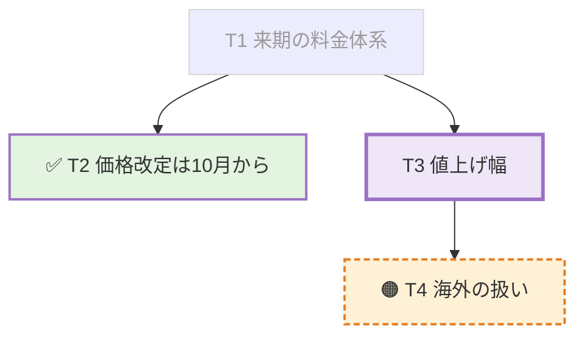

# 議論の板

議事録と同じMarkdownファイルの指定見出しを、自動送信で更新する。手動は議事録本文、自動は板を担当する。[第1段の実験](whiteboard-prototype.md)の後継。

## 設定と受け渡し

```toml
[[ai]]
name = "議事録と板"
cli = "codex"
board = "## 板"
autoPrompt = "議事録を更新してください"
autoStart = true
autoIntervalMinutes = 1
# boardPrompt = "板の独自プロンプト全文"
```

- boardはMarkdown見出し1行。#は1〜6個、半角空白、見出し本文が必要。空・複数行・NUL・プロファイル間の重複を拒否する。比較ではNFC/NFDを同一視する。
- board省略時は従来の動作。boardPromptだけを指定した設定、空のboardPromptはエラー。全文の差し替えは設定で行う。
- 板の自動送信には人が指定した議事録パスが必要。開始シートの空欄は理由を表示して開始を拒否する。既定ファイルは作らない。録音中の自動開始も同じ検証を通す。
- 自動送信は内蔵文面またはboardPromptを使う。autoPromptは手動シートの初期値として維持する。
- participant.board_headingは任意の文字列。明示nullを拒否する。手動にも会議の固定値を渡し、Skillで板の見出しと配下の変更を禁止する。
- 会議Markdownの送信文は「板を更新(## 板)」とこの文書への参照にする。送信した全文は固定requestに残る。

## 保存と表示

板の見出しは最初の自動送信開始時にai/minutes.jsonのboard_headingへ保存する。schema_versionは1で旧ファイルは省略を許す。既存のrevision比較更新を使い、対象パス・target_source・通知の到達点は変更しない。会議途中の異なる見出しへの変更は拒否する。

パス欄の下に「議事録」「板」のタブを置く。見出しの紐づけがなく、またはファイル内に指定見出しがなければタブは出ない。議事録から板の見出しと配下を除き、板には配下だけを出す。目次・検索・折りたたみ・紫の更新強調はそれぞれの描画器で保持する。Neovim・Obsidianは共通の元ファイルを開く。

見出し切り出しはコードフェンスとfrontmatterを除外し、次の同階層以上のATX見出しで止まる。AIの実編集はプロンプトとSkillの契約で制限し、アプリがAIのファイル書き込みを監査・差し戻しするものではない。

## 内蔵プロンプト全文

Sources/KikigakiCore/Board.swiftのBoardPrompt.builtInとテストで機械照合する。

````text
議論の板を更新してください。「いま何を話しているか」を1画面で見せる板です。

書き先は participant.minutes_path のファイル内の participant.board_heading です。必ず既存ファイルを読んでから、その見出しの直後から次の同階層以上の見出しの直前までだけを差し替えてください。他の見出しと本文は一切触りません。コードブロック内の見出しは区切りではありません。NFC/NFDの違いは同じ見出しとして扱います。見出しが無ければ末尾に見出しごと追加し、ファイルが無ければ作成してください。書き先か見出しが無ければ作業を止めて理由を返してください。

型は次の4ブロックと順序を守ります。見出し行は participant.board_heading をそのまま使い、その配下に置きます。「論点」「立場」「直近の動き」は板より1段深い見出しにし、板が第6階層なら太字の段落にします。

- 現在地: <ID> <論点名>
- 更新: <HH:MM> / 第<n>版

### 論点



### 立場

| 論点 | タダシ | 田中 |
| --- | --- | --- |
| T3 値上げ幅 | 10%まで | 5%が上限 |

### 直近の動き

- T3 が新しく立った
- T2 が決まった

規則:

- 上の内容は型の例です。会話に無い論点・立場を足しません。聞き取れない箇所は書かず、話者の取り違えや立場が曖昧なら表へ書きません。
- ノードIDはT1から初出順に採番します。一度付けたIDを変更・再利用せず、文言を書き直してもIDを保ちます。12個を超える場合だけ決着して2版以上動かない論点を図から畳み、IDを再利用しません。
- 既存行の順序を保ち、変わった行だけを書き換え、新しいノードと矢印は各々の末尾へ追記します。毎回ゼロから組み直しません。flowchart TBを維持し、subgraphは使いません。
- ラベルは20字以内で必ず ["..."] で囲み、内部に [ ] " を入れません。状態の印に続けてIDと本文を書きます。印なしはこれから決めるもの、✅ は決まった、🟠 は保留、❌ は却下、💬 は決定対象でない前提・所感です。
- ✅ はdone、🟠 はhold、❌ はrejectedのclassを付けます。現在地はちょうど1つでnow、直前の版から内容・状態・立場が動いた論点はhot、2版以上動いていないものはcoldです。now/hot/coldは同じIDへ重ねず、状態のclassより後に指定します。
- 派生関係は T1 --> T3 の矢印を追加順で並べます。
- 議事録本文に論点と対応する見出しがあれば、単独行の click Tn "#見出し" で結びます。見出しに {#id} があれば "#id" を使います。存在しない見出しを作ったり、外部URLやJavaScript callbackを指定したりしません。
- 立場の表は意見が割れている論点だけにし、全員一致と未表明は書きません。話者名は会話のまま、立場は10字以内。割れていなければ表の代わりに「まだ割れていない」と書きます。
- 直近の動きは3行まで。古い行は消します。論点は12個までです。

保存後にminutesで通知しないでください。表示対象は既に議事録です。accept、progress --editing、保存、progress --replying、reply --kind answeredの順に進め、answeredは「第n版: 動いた点」の1〜2行だけにしてください。
````

## カードから議事録へ

板のMermaidで単独行の `click T1 "#見出し"` または `click T1 href "#id"` を受け取る。図のカードをクリックすると議事録タブへ切り替え、既存の見出しアンカー移動と着地強調を使う。Enter・Spaceでも移動できる。

Mermaid公式仕様ではclickはstrictで無効になるため[^click]、strict・CSP・SVGのa要素禁止は維持し、内部見出しへの指定だけを描画前に抜き出す。sanitize後のT番号に対応するノードへ、アプリの見出し移動操作だけを結び付ける。外部URL・callback・任意HTML・tooltip付き指定は対象外。許可範囲をMermaid全体へ広げないための設計である。

[^click]: [Mermaid公式: Interaction](https://mermaid.js.org/syntax/flowchart.html#interaction)

## 検証結果

2026-09-22に検証。`swift build` 成功、`swift test` 全724テスト成功。Web描画器の `npm test` は15テスト成功。

Coreで設定の正常・型違い・空・重複、内蔵文面の機械照合、コードフェンス内の偽見出し、同階層以上の境界、末尾追加、NFC/NFD、CRLF、任意envelopeの省略と明示null、会議Markdownの要約を確認した。アプリでは開始シートのパス必須、会議設定の復元と保存競合、別宛先への手動送信の見出し保護、別タブの本文分離、見出し消失時のタブ非表示、実Mermaidの内部カード移動と外部click無効を確認した。

`./scripts/make-app.sh` で組んだアプリの `--preview-minutes` で両タブを撮影。第1段の第29版を作業用Markdownへ複製し、板より深い見出しに調整して使った。12論点では縦スクロールが必要だった。


### 実herdrを使うreplay

指定された `2026-09-14_0044.wav` の試験は未実行。自動承認レビューが音声由来データの外部Codex送信を拒否し、発注文の明示指定を示した再審査でも拒否された。音声は送信していない。

安全な代替として、ffmpegで生成した無音WAVと架空の手入力2件だけを使う試験を実行した。設定と保存先は `/private/tmp/kikigaki-board-stage2` に隔離した。実herdrのworkspace作成、内蔵プロンプト入りの固定request作成、`board_heading` と `minutes_path` の受け渡し、`minutes.json` の見出し固定、会議Markdownの要約は確認できた。ただしCodex起動が `agent_not_ready` で失敗し、AIへの送信・受領・ファイル実更新・answeredの往復は確認できなかった。録音停止後に自分のAIペインが閉じるところは確認した。既定cwdでの再試行も自動承認レビューに拒否され、未実行。

証跡:

- `/private/tmp/kikigaki-board-stage2/synthetic-replay.log`
- `/private/tmp/kikigaki-board-stage2/output/.kikigaki-context/E347F2F2-9969-4FB7-9033-F757DEC27C56/ai/`
- `/private/tmp/kikigaki-board-stage2/output/2026-09-22_1028.md`

### 受入手順

1. `./scripts/make-app.sh` を実行する。
2. 作業用configへ上の設定例を書き、outputDirも作業用へ向ける。開始シートで板を選び、議事録欄が空なら開始できないことを確認する。
3. 議事録パスを指定して開始する。自動更新で板の見出しができたら「議事録」「板」を切り替え、本文と目次が分離することを確認する。
4. 手動実行で本文を更新し、板が保たれることを確認する。板の内部clickカードは議事録タブへ移り、対応する見出しへ着地する。
5. 録音を止め、最後の回答を待つ。会議の保存状態を読み直して同じ見出しのタブが復元することを確認する。

指定音声の外部AI送信について承認を得た後のreplay例。AI側に現行Skillが導入され、cwdの初回信頼確認が済んでいる環境で実行する。

```sh
env KIKIGAKI_DEBUG_AI_AUTO_PROFILE=板 \
  KIKIGAKI_DEBUG_AI_AUTO_SECONDS=35 \
  KIKIGAKI_DEBUG_MINUTES_PATH=/private/tmp/kikigaki-board-stage2/output/minutes.md \
  KIKIGAKI_DEBUG_REPLAY_HOLD=240 \
  .build/KIKIGAKI.app/Contents/MacOS/KIKIGAKI --show-window \
  --config /private/tmp/kikigaki-board-stage2/config.toml \
  --replay ~/Documents/KIKIGAKI/2026-09-14_0044.wav
```

`KIKIGAKI_DEBUG_AI_AUTO_PROFILE` は内蔵または設定の板プロンプトを選び、本番の開始経路を通す。登録先もoutputDirへ隔離する。間隔はAUTO_SECONDS、パスはMINUTES_PATHで注入する。これらは通常起動では無視し、`--smoke --replay` で入力検証だけを行える。

## 限界

AIによる読み違い、応答時間による遅れ、Mermaidの再配置は第1段と同じ。複数AIによる同じファイルの同時編集は排他制御しない。保存直前の再読込を指示するが、競合の完全な防止は保証しない。板の過去版をアプリ内で復元する機能はない。

板設定のない宛先で通常の自動送信へ切り替えた場合は従来の動作になり、その自動依頼には板の保護を追加しない。同一見出しが文書内に複数ある場合は先頭だけを板として扱う。`<small>` の描画は今回の対象外。
