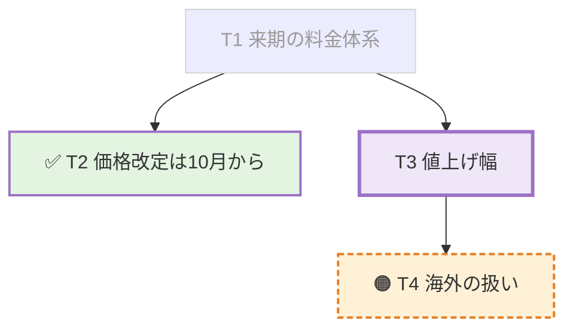

# 議論のボード

議事録と同じMarkdownファイルの指定見出しを、自動送信で更新する。手動は議事録本文、自動はボードを担当する。[第1段の実験](whiteboard-prototype.md)の後継。

## 設定と受け渡し

```toml
[[ai]]
name = "議事録とボード"
cli = "codex"
board = "## ボード"
boardLocation = "~/Documents/minutes/${yyyyMMdd_HHmmss}.md として作成し、変数は現在日時"
autoPrompt = "議事録を更新してください"
autoStart = true
autoIntervalMinutes = 1
# boardPrompt = "ボードの独自プロンプト全文"
```

- boardはMarkdown見出し1行。#は1〜6個、半角空白、見出し本文が必要。空・複数行・NUL・プロファイル間の重複を拒否する。比較ではNFC/NFDを同一視する。
- board省略時は従来の動作。board無しのboardPrompt・boardLocation、空または空白だけの値、型違いはエラー。作成指示を付けたプロンプト全体も32 KiB以内に収める。
- boardLocationは任意の自由文。議事録パスが無いときの書き先の作り方をAIへ伝える。`${...}` や `~` はアプリで展開しない。任意の保存先への書き込み許可を追加する設定ではない。
- ボードの自動送信は議事録パスかboardLocationがあれば開始できる。どちらも無ければ「ボードの自動送信には議事録のパスか boardLocation が必要です」と表示して拒否する。録音開始シート、録音中の自動開始、AIScheduleSheetで同じ条件を使う。
- 自動送信は内蔵文面またはboardPromptを使う。boardPromptは全文差し替えのまま。パスが無い送信だけ共通の作成・通知指示とboardLocationを末尾に付け、通知後は付けない。autoPromptは手動シートの初期値として維持する。
- participant.board_headingは任意の文字列。明示nullを拒否する。手動にも会議の固定値を渡し、Skillでボードの見出しと配下の変更を禁止する。
- 会議Markdownの送信文は「ボードを更新(## ボード)」とこの文書への参照にする。送信した全文は固定requestに残る。

## 保存と表示

タブ名は見出し行の `(HH:MM 更新)` があれば `ボード HH:MM`、なければ `ボード` とする。

ボードの見出しは最初の自動送信開始時にai/minutes.jsonのboard_headingへ保存する。schema_versionは1で旧ファイルは省略を許す。既存のrevision比較更新を使い、対象パス・target_source・通知の到達点は変更しない。会議途中の異なる見出しへの変更は拒否する。

パス無しで作成したAIは同梱CLIの `minutes --path` で絶対パスを通知する。通知は `minutes_path` と `target_source: "ai"` に保存し、右ペインの表示先を切り替える。人の指定を表す `human_minutes_path` へはコピーしない。ボードの会議では以後の手動・自動送信に、人の指定を優先し、無ければ通知されたパスを `participant.minutes_path` として渡す。送信操作の入口で見出しとパスを固定する。ボードのない会議ではAI通知を次の書き先へ伝播しない。

人がパスを変更した場合はそちらを優先する。空欄へ戻すと通知済みパスも解除し、次のボードの送信は再びboardLocationを使う。通知の時刻順・人の操作より古い通知の除外は従来どおり。

パス欄の下に「議事録」「ボード」のタブを置く。見出しの紐づけがなく、またはファイル内に指定見出しがなければタブは出ない。議事録からボードの見出しと配下を除き、ボードには配下だけを出す。目次・検索・折りたたみ・紫の更新強調はそれぞれの描画器で保持する。Neovim・Obsidianは共通の元ファイルを開く。

設定は `board = "## ボード"` のまま、AIは毎回実時刻を確認して `## ボード(17:48 更新)` の形へ見出し行ごと更新する。見出し切り出しは設定値と完全一致する行か、直後に `(HH:MM 更新)` だけが付く行を認める。時刻は00:00〜23:59。`## ボード2` や任意の接尾辞は認めない。時刻付きでもタブの表示範囲は同じで、ボードタブは図から始まる。概要行と「論点」見出し、版数は表示しない。立場に続いて、デバッグ用の「直近の動き」を最下部へ置く。

見出し切り出しはコードフェンスとfrontmatterを除外し、次の同階層以上のATX見出しで止まる。`BoardSection.replacing` は `headingLine` を渡すと見出し行も差し替え、省略時は既存行を保つ。NFC/NFDを同一視し、差し替えた見出しのCRLFと他の節のバイト表現を保つ。AIの実編集はプロンプトとSkillの契約で制限し、アプリがAIのファイル書き込みを監査・差し戻しするものではない。

## 内蔵プロンプト全文

Sources/KikigakiCore/Board.swiftのBoardPrompt.builtInとテストで機械照合する。

````text
議論のボードを更新してください。「いま何を話しているか」を1画面で見せるボードです。

書き先は participant.minutes_path のファイル内の participant.board_heading です。必ず既存ファイルを読んでから、その見出し行から次の同階層以上の見出しの直前までだけを差し替えてください。他の見出しと本文は一切触りません。コードブロック内の見出しは区切りではありません。設定の見出し行と完全一致する行、または直後に (HH:MM 更新) だけが付いた行を対象にし、任意の続きは認めません。NFC/NFDの違いは同じ見出しとして扱い、他の節の改行を保ってください。見出しが無ければ末尾に見出しごと追加し、ファイルが無ければ作成してください。書き先が無ければ末尾の「書き先が無いときの作り方」に従って作成してください。その指示も無い場合、または participant.board_heading が無い場合は作業を止めて理由を返してください。

毎回、実際の現在時刻を確認し、見出し行を <participant.board_heading>(HH:MM 更新) で書き直してください。例: ## ボード(17:48 更新)。設定の見出し自体は変えません。

型はMermaid図、立場、直近の動きの順序を守ります。ボードの見出し直後からMermaid図を置き、概要行と「論点」見出しは置きません。版数は本文にも返答にも出しません。「立場」「直近の動き」はボードより1段深い見出しにし、ボードが第6階層なら太字の段落にします。



### 立場

| 論点 | タダシ | 田中 |
| --- | --- | --- |
| T3 値上げ幅 | 10%まで | 5%が上限 |

### 直近の動き

- T3 が新しく立った
- T2 が決まった

規則:

- 上の内容は型の例です。会話に無い論点・立場を足しません。聞き取れない箇所は書かず、話者の取り違えや立場が曖昧なら表へ書きません。
- ノードIDはT1から初出順に採番します。一度付けたIDを変更・再利用せず、文言を書き直してもIDを保ちます。12個を超える場合だけ決着して2版以上動かない論点を図から畳み、IDを再利用しません。
- 既存行の順序を保ち、変わった行だけを書き換え、新しいノードと矢印は各々の末尾へ追記します。毎回ゼロから組み直しません。flowchart TBを維持し、subgraphは使いません。
- ラベルは20字以内で必ず ["..."] で囲み、内部に [ ] " を入れません。状態の印に続けてIDと本文を書きます。印なしはこれから決めるもの、✅ は決まった、🟠 は保留、❌ は却下、💬 は決定対象でない前提・所感です。
- ✅ はdone、🟠 はhold、❌ はrejectedのclassを付けます。現在地はちょうど1つでnow、直前の版から内容・状態・立場が動いた論点はhot、2版以上動いていないものはcoldです。now/hot/coldは同じIDへ重ねず、状態のclassより後に指定します。
- 派生関係は T1 --> T3 の矢印を追加順で並べます。
- 議事録本文に論点と対応する見出しがあれば、単独行の click Tn "#見出し" で結びます。見出しに {#id} があれば "#id" を使います。存在しない見出しを作ったり、外部URLやJavaScript callbackを指定したりしません。
- 立場の表は意見が割れている論点だけにし、全員一致と未表明は書きません。話者名は会話のまま、立場は10字以内。割れていなければ表の代わりに「まだ割れていない」と書きます。
- 直近の動きはデバッグ用として最下部に残し、3行まで。古い行は消します。論点は12個までです。

participant.minutes_path がある場合は、保存後にminutesで通知しないでください。書き先が無く指示に従って作成した場合は、保存成功後に同梱CLIの minutes --path で実際の絶対パスを通知してください。accept、progress --editing、保存、必要なminutes通知、progress --replying、reply --kind answeredの順に進め、answeredは動いた点の1〜2行だけにしてください。
````

パス無しかつboardLocationありのときは、内蔵文面・boardPromptのどちらにも空行と次の固定文面を付け、その次の行にboardLocationをそのまま付ける。BoardPrompt.locationInstructionとテストで機械照合する。

```text
書き先が無いときの作り方:
participant.minutes_path が無いので、次の指示に従って書き先を決め、ボードを含む議事録ファイルを作成してください。変数はAIが解釈してください。保存成功後、answeredの前に同梱CLIの minutes --path で実際の絶対パスを通知してください。以後は通知したファイルが participant.minutes_path として渡されます。
```

## カードから議事録へ

ボードのMermaidで単独行の `click T1 "#見出し"` または `click T1 href "#id"` を受け取る。図のカードをクリックすると議事録タブへ切り替え、既存の見出しアンカー移動と着地強調を使う。Enter・Spaceでも移動できる。

Mermaid公式仕様ではclickはstrictで無効になるため[^click]、strict・CSP・SVGのa要素禁止は維持し、内部見出しへの指定だけを描画前に抜き出す。sanitize後のT番号に対応するノードへ、アプリの見出し移動操作だけを結び付ける。外部URL・callback・任意HTML・tooltip付き指定は対象外。許可範囲をMermaid全体へ広げないための設計である。

[^click]: [Mermaid公式: Interaction](https://mermaid.js.org/syntax/flowchart.html#interaction)

## 検証結果

### 時刻付き見出しと図先頭への変更

2026-09-22に `swift build`、`swift test` 全731件、`web/minutes` の `npm test` 15件が成功。`./scripts/make-app.sh` のビルドと署名も成功。時刻の飾りの有無・不正な接尾辞・NFC/NFD・CRLF・見出し行ごとの差し替え・内蔵全文の照合・時刻付き見出しのタブ分離を検証した。JSは変更していない。

指定音声 `2026-09-14_0044.wav` を約10倍速replayし、内蔵プロンプトをCodexへ2回送信してansweredを回収した。1回目は `## ボード(18:06 更新)` で作成し、2回目は同じファイルの見出しを `## ボード(18:07 更新)` へ更新した。実ファイルの見出しはNFD表記で、設定のNFC表記と同じ対象として認識した。両方とも見出し直後がMermaid図、その後が立場、最下部が直近の動きとなり、概要行・「論点」見出し・版数は無い。minutes通知後の2回目には同じminutes_pathが渡った。

実生成ファイルを署名済み.appで開き、ボードタブが出て図から始まることを撮影で確認した。別途、前後に議事録本文を持つ検証用Markdownで両タブの分離も撮影した。見出し行と更新時刻は元Markdownに残し、既存どおりボードタブには配下だけを表示する。AIペインの終了を確認した後、起動したreplayプロセスだけをPIDで停止した。音声認識の精度や実会議中の視認性はこの試験の対象外。

証跡は `/private/tmp/kikigaki-board-clock.9oFRdz/` に保存した。`config.toml` と `output/` を隔離し、利用者の既存config・録音・議事録は変更していない。

- `board-first.md` と `board-second.md`: 各更新後の実ファイル
- `replay.log` と `output/.kikigaki-context/`: replayのログと固定request・返送
- `replay-capture/`: 実生成ファイルの両タブ
- `capture/`: 前後の議事録本文を含む検証用Markdownの両タブ

### boardLocation対応

`./scripts/make-app.sh` のビルドと署名が成功。`swift test` 全728件成功。初回の全体実行では既存の接続待機テスト1件がtimeoutとなり、同じ全体の再実行で成功した。

設定の孤立・不正値・合成後のサイズ上限、内蔵と独自プロンプトへの条件付き付与、変数の非展開、開始の3経路を検証する。結合テストでは初回のパス省略、minutes通知の回収、target_sourceがaiのままの保存、2回目のパス受け渡しと作成指示の除去、手動送信へのパスと保護見出しの受け渡し、通知したファイルのタブ表示を確認する。

実音声replayは自動承認レビューにより起動前に拒否された。理由は「replayにより指定音声由来の内容を外部AIへ送信する高リスクのデータ外部送信ですが、この評価で信頼できる明示的な送信許可は確認できません」。発注文には実施許可があったが、アプリは起動できていない。実AIによるファイル作成・minutes通知・第2版以降の継続更新は未確認。作成ファイルと版数は無い。代替replayで検証済みとは扱わない。

作業用configは `/private/tmp/kikigaki-board-location.N5tP9R/config.toml`、保存先はその隣の `output/` に隔離した。boardLocationも同じoutput配下を指定した。既存の利用者configと録音・議事録は変更していない。インストール済みSkillが旧版のため、試験configのpromptではビルドした.app内のSkillを読むよう明示した。

### 第2段導入時

2026-09-22に検証。`swift build` 成功、`swift test` 全724テスト成功。Web描画器の `npm test` は15テスト成功。

Coreで設定の正常・型違い・空・重複、内蔵文面の機械照合、コードフェンス内の偽見出し、同階層以上の境界、末尾追加、NFC/NFD、CRLF、任意envelopeの省略と明示null、会議Markdownの要約を確認した。アプリでは開始シートのパス必須、会議設定の復元と保存競合、別宛先への手動送信の見出し保護、別タブの本文分離、見出し消失時のタブ非表示、実Mermaidの内部カード移動と外部click無効を確認した。

`./scripts/make-app.sh` で組んだアプリの `--preview-minutes` で両タブを撮影。第1段の第29版を作業用Markdownへ複製し、ボードより深い見出しに調整して使った。12論点では縦スクロールが必要だった。


### 実herdrを使うreplay

指定された `2026-09-14_0044.wav` の試験は未実行。自動承認レビューが音声由来データの外部Codex送信を拒否し、発注文の明示指定を示した再審査でも拒否された。音声は送信していない。

安全な代替として、ffmpegで生成した無音WAVと架空の手入力2件だけを使う試験を実行した。設定と保存先は `/private/tmp/kikigaki-board-stage2` に隔離した。実herdrのworkspace作成、内蔵プロンプト入りの固定request作成、`board_heading` と `minutes_path` の受け渡し、`minutes.json` の見出し固定、会議Markdownの要約は確認できた。ただしCodex起動が `agent_not_ready` で失敗し、AIへの送信・受領・ファイル実更新・answeredの往復は確認できなかった。録音停止後に自分のAIペインが閉じるところは確認した。既定cwdでの再試行も自動承認レビューに拒否され、未実行。

証跡:

- `/private/tmp/kikigaki-board-stage2/synthetic-replay.log`
- `/private/tmp/kikigaki-board-stage2/output/.kikigaki-context/E347F2F2-9969-4FB7-9033-F757DEC27C56/ai/`
- `/private/tmp/kikigaki-board-stage2/output/2026-09-22_1028.md`

### 受入手順

1. `./scripts/make-app.sh` を実行する。
2. 作業用configへ上の設定例を書き、outputDirとboardLocationを作業用へ向ける。開始シートでボードを選び、議事録欄が空でも開始できることを確認する。boardLocationも省略した設定では開始を拒否することを、開始シートと録音中の自動実行シートで確認する。
3. AIが作成したファイルをminutesで通知し、ai/minutes.jsonのtarget_sourceがai、board_headingが指定見出しになることを確認する。2回目以降の固定requestには同じminutes_pathが入り、作成指示が消え、同じファイルの見出し行の時刻が更新される。同じ分の更新では時刻表示は同じになる。「議事録」「ボード」を切り替え、本文と目次が分離し、ボードが図・立場・直近の動きの順であることを確認する。人が議事録パスを指定した場合は、初回からそのパスを使いboardLocationを付けない。
4. 手動実行で本文を更新し、ボードが保たれることを確認する。ボードの内部clickカードは議事録タブへ移り、対応する見出しへ着地する。
5. 録音を止め、最後の回答を待つ。会議の保存状態を読み直して同じ見出しのタブが復元することを確認する。

指定音声の送信を実行できる環境でのreplay例。AI側に現行Skillが導入され、cwdの初回信頼確認が済んでいる環境で実行する。MINUTES_PATHは設定しない。既定の約10倍速を使う。

```sh
env KIKIGAKI_DEBUG_AI_AUTO_PROFILE=ボード \
  KIKIGAKI_DEBUG_AI_AUTO_SECONDS=35 \
  KIKIGAKI_DEBUG_REPLAY_HOLD=240 \
  .build/KIKIGAKI.app/Contents/MacOS/KIKIGAKI --show-window \
  --config /private/tmp/kikigaki-board-location.N5tP9R/config.toml \
  --replay ~/Documents/KIKIGAKI/2026-09-14_0044.wav
```

`KIKIGAKI_DEBUG_AI_AUTO_PROFILE` は内蔵または設定のボードプロンプトを選び、本番の開始経路を通す。登録先もoutputDirへ隔離する。間隔はAUTO_SECONDSで注入する。パス指定ありの試験ではMINUTES_PATHを指定する。これらは通常起動では無視し、`--smoke --replay` で入力検証だけを行える。

## 限界

AIによる読み違い、応答時間による遅れ、Mermaidの再配置は第1段と同じ。複数AIによる同じファイルの同時編集は排他制御しない。保存直前の再読込を指示するが、競合の完全な防止は保証しない。ボードの過去版をアプリ内で復元する機能はない。

ボード設定のない宛先で通常の自動送信へ切り替えた場合は従来の動作になり、その自動依頼にはボードの保護を追加しない。同一見出しが文書内に複数ある場合は先頭だけをボードとして扱う。`<small>` の描画は今回の対象外。

ボードの会議で人の指定が無い場合、別プロファイルの新しいminutes通知も共有の書き先になる。書き先を固定したい場合は人がパスを指定する。AI通知の時刻順処理を維持し、ボード専用の別のパス保存先は設けない。
