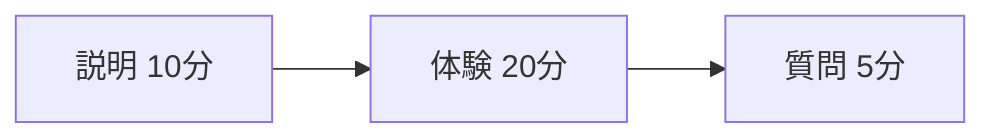

# 体験会の準備会議

社内10名を対象に体験会を開き、説明・体験・質問を一続きで行う方針に合意しました。

## 決定事項 {#decisions}

- [x] 社内向けに開催する
  - 説明10分、体験20分、質問5分
  - **初めて参加する人**にも分かる案内を用意する
- [ ] 受付担当と予備端末を確保する

> [!NOTE] 開催前に確認
> 会場の接続テストは前日までに行います。参加方法と持ち物も案内文へ記載します。

| 担当 | 次回までに行うこと | 期限 |
| --- | --- | --- |
| 佐藤 | 案内文を作成し、集合場所を明記する | 次回の会議 |
| 鈴木 | 会場予約と接続テスト | 開催前日 |

## 当日の流れ



参加率は $r = \frac{n}{N}$ で集計します。[^attendance]

[^attendance]: $n$ は参加者数、$N$ は対象者数です。欠席の連絡も記録します。

### 会場の配置

```svg
<svg xmlns="http://www.w3.org/2000/svg" width="440" height="100" viewBox="0 0 440 100">
  <rect x="1" y="1" width="438" height="98" rx="8" fill="#ede0cd" stroke="#d5c6b1"/>
  <rect x="20" y="25" width="110" height="50" rx="4" fill="#5b3e7a"/>
  <text x="75" y="56" fill="#f5ead9" text-anchor="middle" font-size="16">受付</text>
  <text x="270" y="56" fill="#221f1c" text-anchor="middle" font-size="16">体験スペース</text>
</svg>
```

[決定事項へ戻る](#decisions)

## 補足資料

:::{note}
MySTのコロンフェンス。**注意点**やリストも本文として描画します。
:::

:::tip
短いコロン形式にも対応します。
:::

```{warning}
コードフェンス形式の注意書きです。
```

!!! example "字下げ形式"

    `!!!` の本文は4空白字下げで書きます。**強調**やリストも描画します。

    - 項目

<div style="padding:12px;border:1px solid purple;border-radius:8px;color:purple">HTMLの枠と文字色を描画します。</div>

<details><summary>HTMLの補足を開く</summary><p>文書要素は表示し、スクリプトやイベント属性は除去します。</p></details>
