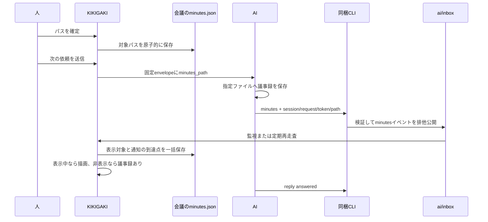

# 議事録のMarkdownプレビュー

本書は段1の交差レビューと本人裁定を反映した設計。既存の送信・返送契約は [AI参加者の設計](ai-participant.md)、複数宛先の契約は [AIプロファイル](ai-profiles.md) を参照する。

## 決定済みの動作

- プレビューは「対象なし」で始まる。既定の議事録パスを設けず、会議開始だけでは議事録ファイルを生成しない。
- 人が指定したパスは、以後の送信envelopeの `participant.minutes_path` へ絶対パスで渡す。既存requestは変更しない。
- AIが議事録を作成・更新したら、同梱CLIの `minutes` でパスを通知する。アプリは対象を切り替える。非表示なら開かず、フッターに「議事録あり」を出す。
- 場所は任意。アプリがCodexへ追加する書き込み許可は `outputDir` までで、選択された任意のパスを追加しない。
- 表示ONで右へ広げ、標準状態は600→1800pt。会話側の幅を維持し、画面に収まらない分を縮める。OFFではその時点の左ペインの幅へ戻す。分割位置と表示状態は再起動後も復元する。
- 描画は `MarkdownBlocks` と `MarkdownBodyRenderer` を流用し、スクロール用のNSTextViewを別に持つ。frontmatterを隠し、wikilinkはリンク名だけの文字にする。画像・埋め込みは記法を文字で残す。対応しない記法で本文を捨てない。

プレビューは閲読用であり、パス欄の操作で議事録本文を書き換えない。議事録は文字起こしの会議Markdownとは別の成果物であり、`minutes` は会議Markdownへの追記も行わない。

## 既存コードと責務の分担

| 既存箇所 | 現状と追加する責務 |
| --- | --- |
| `AIParticipantContext` / `AIEnvelope` | 固定requestの契約へ任意のパスを追加し、Coreで形式検証する。 |
| `AIReceiveEvent` / `AIQuestion` | 現状はacceptとresultの固定枠。議事録通知をresultに混ぜず、別の `AIMinutesEvent` として扱う。 |
| `ReturnCommand` / `AIFileStore` / `AIInbox` | sessionとrequestの照合、fdでの検証、排他公開を再利用する。新しい通信経路やtokenを作らない。 |
| `AIConversationController.scan` | 既知requestのminutesも回収し、会議の議事録状態へ渡す。受領基準や質問の状態を更新しない。 |
| `MinutesStore` / `AIRecordStore` / `MeetingSession` | 会議IDごとに1つのMainActorのstoreをアプリ全体の辞書で共有し、人の指定と通知の回収を直列化する。 |
| `TranscriptWindow` | 現在表示中の会議へプレビューを接続する。過去会議ウィンドウは対象外。 |
| `AIInboxMonitor` | fdの同一性確認とTimerの再走査を、議事録ファイルの監視へ応用する。 |

既存manifestはAIプロファイルを必須にし、AI利用開始時に初めて作る。人だけで使うプレビューをその生成条件へ結び付けないため、議事録のmanifest相当情報を同じ会議の `ai/minutes.json` へ分ける。パスの正本はこの1か所にし、既存 `ai/manifest.json` へ複製しない。

## 両方向の受け渡し



`minutes_path` が無ければ、AIは依頼文から書き先を決める。通知後はそのパスがプレビュー対象になるが、envelopeへは伝播しない。envelopeに載せるのは人が指定したパスだけであり、別プロファイルの通知でAIの書き先を変更しない。パスだけで議事録作成の依頼・作業許可・ファイルの実在を推定しない。

### envelope

`participant.minutes_path` は省略可能な文字列。既存のparticipant版1へ追加し、旧requestの欠損は対象なしとする。明示nullや文字列以外は拒否する。非指定時はキーを省略し、空文字を出さない。

パスは `/` 始まりで、NUL・制御文字・改行を含まないローカルの `.md` ファイル名とする。UTF-8で1024バイト以下。拡張子は大文字小文字を区別しない。先頭以外の空要素、`.`、`..`、末尾 `/`、経路要素 `.kikigaki-context` をCoreとCLIで拒否する。JSONとCLIは `~`、相対パス、file URLを受け取らない。同一性はSwiftの文字列としての等価性で、symlink解決先や大文字小文字の違いを同一視しない。Coreは実在・読み書き権限を調べず、`AIEnvelope.validate` から参加者の検証へ到達させる。既存のenvelope全体のサイズ上限は維持する。

段2で確定したパス検証規則は以後強化しない。保存済みstateの復号でも全requestを検証するため、強化は過去会議の読込を壊す。現在の会議の `.md` / `.raw.md` との一致は会議URLを持つアプリ側で拒否する。

管理領域 `.kikigaki-context` の要素比較はASCIIの大文字小文字を区別しない。`controlCharacters` はZWJなどの書式文字も拒否する。後からこの制限を緩めることは許容する。Swiftの文字列比較はNFCとNFDを同一視するため、バイト列の完全一致ではない。

UIは `~` 展開と字句的なパス正規化を行ってからこの検証へ渡す。空欄の確定は対象解除。新規ファイルはまだ存在しなくても指定できる。解決不能な記法はパス欄でエラーにし、直前の対象を維持する。

手動・自動・確認質問への返答・再送のすべてで、送信操作の入口の `capturedAt` と同じ位置、最初のawaitより前に人の指定パスを採取する。確定待ちや起動中に対象を変えても、その送信のrequestへ後付けしない。明示nullの拒否は `trigger` と同様、キーの存在確認後に非Optional文字列としてdecodeする。

### CLIと受信箱イベント

```text
<cli_path> minutes --session <session_path> --request <request_id> --token <request_token> --path <絶対パス>
```

stdinは読まない。4つの必須引数以外、重複引数、空の値を拒否する。`session_path` は既存どおり単一・複数プロファイルの両方の形を認め、階層、世代、会議ID、provider整合、固定requestのsessionパスとrequest tokenを照合する。session tokenでrequest tokenを代用しない。Codexのthread identity保存もaccept/replyと共通の経路を通す。

通知するパスの形式はenvelopeと共通。CLIは議事録本文を開かず、存在確認や本文のコピーをしない。議事録に0600を要求せず、受信箱の所有者・権限の検証と区別する。CLI成功は通知の保存を意味し、議事録作成やアプリでの表示成功を意味しない。

`AIMinutesEvent` の形式を以下に固定する。例の日時は書式の例であり作業記録ではない。

```json
{
  "schema_version": 1,
  "event_id": "11111111-1111-4111-8111-111111111111/minutes",
  "kind": "minutes",
  "meeting_id": "22222222-2222-4222-8222-222222222222",
  "request_id": "11111111-1111-4111-8111-111111111111",
  "session_generation": 1,
  "snapshot_id": "33333333-3333-4333-8333-333333333333",
  "recorded_at": "2026-01-01T00:00:00.000Z",
  "minutes_path": "/Users/example/Documents/notes/定例.md"
}
```

- ファイル名は `<request_id>.minutes.json`、event IDは `<request_id>/minutes`。UUIDの表記は既存のSwift生成形式に揃える。
- 1 requestにつき通知するパスは1つ。同じrequest・同じパスの再実行は成功し、保存時刻の差を同一性に含めない。異なるパスで再実行したら競合エラーにする。定期更新は次requestの通知と、同じファイルの監視で扱う。
- イベントにtoken、議事録本文、`context_received`、回答のbodyやreasonを載せない。minutesは受領・回答・作業成功の代わりにならない。
- 既存の `AILimits.eventBytes` を適用し、通常ファイル・所有者・0600・`st_nlink == 1` を検証する。専用階層は0700、symlinkとFIFOを拒否し、fdを辿る既存検証を共有する。
- 公開は既存 `AIFileStore.write(replacing: false)` の一時ファイル、fsync、close、link、仮名unlink、親fsyncの順を維持する。二重呼出しでは既存内容を検証して親fsync後に成功を返す。
- 終了コード0とstdoutのevent IDが成功。保存失敗・競合・不正入力は既存CLIの非0終了を使い、完成していないイベントを受理させない。

`reply --kind minutes` は認めない。既存のaccept/resultファイル名、`AIReceiveEvent` の版、固定requestファイルは変えない。

CLIのhelp、引数の必須・許可集合、AIInboxのファイル名検証と専用decode、controllerのminutes走査を更新する。旧アプリは新イベントファイルを無視でき、旧requestは新キーなしで引き続き読める。

## 会議ごとの保存と回収

議事録専用のmanifest相当ファイルは `<outputDir>/.kikigaki-context/<meeting_id>/ai/minutes.json`。Coreの `MinutesState` とAIIOの保存adapterで読み書きする。

| 項目 | 型・契約 |
| --- | --- |
| `schema_version` | 整数1。未知版は読めない旨を表示する。 |
| `meeting_id` | 親階層と一致するUUID。 |
| `minutes_path` | 任意文字列。プレビュー対象。未指定は省略し、対象なし。 |
| `human_minutes_path` | 任意文字列。人が指定した書き先。envelopeへはこちらだけを渡す。 |
| `target_changed_at` | 対象を最後に変更したISO8601日時。人の対象解除でも更新する。初期状態は省略。 |
| `target_source` | `human` または `ai`。対象なしなら省略。ファイルなしの案内を区別する。 |
| `last_event` | 任意の `{recorded_at, event_id}`。回収の到達点。時刻、同値ならIDの辞書順で比較する。 |
| `revision` | 比較更新用の0以上の整数。保存成功ごとに増やす。 |

ファイルが無ければ空状態として扱う。壊れた・未知版のファイルは警告を出し、通知を適用しない。人が明示的にパスを確定した場合だけ `minutes.json.broken-<日時>` へ衝突しない名前で退避して再作成し、人の操作時刻を新しい基準にする。退避に失敗したら上書きしない。既存AI manifestの版1・版2と既存会議は無変換で読める。

全更新はアプリ全体で会議IDごとに唯一のMainActorの `MinutesStore` へ渡す。AI未使用の会議も同じ辞書から取得する。保存直前にファイルを読み直し、取得時のrevisionと異なれば新しい状態へ操作を再適用する比較更新にする。人の指定・controller・再起動回収が別々の古い写しを保存してはならない。

回収は送信試行済みの既知requestに対応する通知だけを対象にする。固定requestとのID・snapshot・世代照合を `AIInbox` の共通読取検証で行う。返送時tokenの検証はCLI、受信側は検証済みrequestとの対応と私有受信箱のfd検証を担う。生tokenを通知へ持ち回らせない。

1. 通知を走査し、`recorded_at`、同値ならevent IDの昇順で処理する。到達点以下は再適用しない。
2. `recorded_at` が `target_changed_at` より古い通知は到達点を進めるだけにする。それ以外は表示対象と変更時刻を更新し、人の書き先は維持する。対象と到達点を原子的に保存する。
3. 保存成功後に画面と次回送信用の状態へ反映する。保存失敗なら対象は変えず、受信箱を残して再試行する。

人の指定は表示対象と人の書き先を同時に変更し、対象解除も両方を空にする。到達点は維持し、`target_changed_at` を更新する。遅れて届いた古い通知も巻き戻しを起こさない。人の指定より後に記録された通知は表示対象だけを切り替える。複数プロファイル間でもプレビュー対象は会議につき1つ。

旧世代・取消後・`work_allowed=false` の通知も、送信済みの既知requestへ正しく対応するなら元会議へ回収し、同じ時刻基準を適用する。新会議の対象や質問状態は変えない。複数AIによる議事録本文の同時編集を調停する機能は持たない。

待機中とは会議がまだ1つもない起動直後だけを指す。その指定はメモリだけに保持し、録音開始時に新会議へ引き継ぐ。開始を取り消した場合も指定を保持する。停止後の指定は現在表示中の会議へ保存する。その後の新会議は前会議のパスを引き継がず対象なしに戻る。AI未設定でも人によるパス指定と保存・監視は使える。

対象範囲は現在の会議と、アプリ起動中に保持するAI会議の状態回収まで。過去会議ウィンドウへの接続、完了済み会議の全件再走査、AI未使用会議や全履歴を開く導線は対象外とする。既存の未完了AI会議の再起動回収は維持し、`needsRecovery` へ未適用のminutesイベントを加える。結果が先に届いた場合もminutesの取込状態を見て登録簿を更新する。アプリ終了後に完了済み会議へ新たに届いた通知の発見は、全件走査を行わない範囲制約として残る。

到達点は1件だけを保持し、通知ごとのID配列は保存しない。`has_unseen_minutes` はメモリだけで持ち、回答の未読とは独立する。

形式は正しいがアプリが管理ファイルとして拒否する通知は、対象を切り替えず到達点だけを進める。警告は新たに処理した走査で1回表示する。一時的な読取失敗は再試行待ちとして分ける。`needsRecovery` は走査で判明した未適用通知の有無を保持した値で判定し、設定を読めない間は通知の有無にかかわらず回収登録を残さない。明示修復後は空の到達点から通知を判定し直す。壊れた設定の警告と修復導線は現在の会議のプレビューに限る。登録簿判定のたびに受信箱を再読込せず、次の監視走査で反映する。保存できなかった人の指定は、再試行時刻を採り直す。

親階層の欠損を未作成と解釈するのはminutes用のAIFileStoreだけとする。既存の受信箱走査・CLIでは `unsafe_file` の契約を維持する。CLIのminutesで指定パスが不正な場合は、本文やパスを含めない `invalid_path` を返す。

## ウィンドウと操作

左ペインのヘッダー右端へ「議事録」ボタンを1つ追加する。SF Symbolは `sidebar.right` 系を用い、「議事録を表示」または「議事録を隠す」のツールチップとアクセシビリティラベルを付ける。メニューバーにも同じ切替を置き、状態とアクションを共有する。フッターの「…」には追加しない。無効時は色を抜き、無効状態だけの背景面を足さない。

左右の `NSSplitView` にし、左には従来のヘッダー・検索・会話・入力・フッターをまとめて置く。右は上部の編集可能パス欄と「ファイルを選ぶ…」と閉じるボタン、下部の独立したスクロール領域。NSOpenPanelは単一の `.md` ファイルに限定し、取消では対象を変えない。未作成パスはパス欄から指定する。編集中の通知で入力文字を置き換えず、パス欄の下に対象が変わった旨を1行表示し、編集の確定・取消時に反映する。

| 右ペインの状態 | 表示 |
| --- | --- |
| 対象なし | 「議事録のファイルを指定するか、AIに書かせると表示します」 |
| 読込中 | パスを残して読込中を表示。別ファイルの古い本文を出さない。 |
| 読込成功 | Markdown本文。空ファイルは「議事録はまだ空です」。 |
| ファイルなし | 人の指定は「見つかりません」、AI由来は「AIが通知したファイルが見つかりません」。パスを残して監視を続ける。 |
| 読取失敗 | 権限・文字コード・サイズ等の原因を簡潔に表示し、再読込できる。 |

非表示中のAI通知は既存の未読ピルの型で「議事録あり」を表示する。クリックでプレビューを開き、同じ印を消す。通知音と前面化はしない。表示中の通知は対象を切り替えて描画し、印は立てない。人のファイル選択だけでは印を立てない。印は内容を確認した証明やファイル実在の保証ではない。

### 幅と復元

- 初回ONの要求幅は、現在の会話幅+1200pt。600ptなら合計1800ptで、区切り線は追加分に含める。左端と上端を維持して右へ広げる。
- OFFはその時点の左ペイン幅へ戻す。表示中の手動リサイズでは原則として右側を伸縮し、区切り線のドラッグで左右配分を変更する。
- 再ONは保存した左右の幅を復元する。初期値、明示的なドラッグ、ウィンドウリサイズの扱いを純粋な幅計算へ分離する。左の最小幅420pt、右320pt。ON中の `minSize` は両者と区切り線の合計にする。
- 切替・画面変更ごとに現在の `NSScreen.visibleFrame` を取り直す。まず右側の追加幅を画面右端まで縮め、必要なら左端を画面内へ移動する。それでも両ペインの最小幅が収まらない画面では画面内に収めることを優先する。
- UserDefaultsの1キーに `{visible, leftWidth, rightWidth}` を保存する。起動時のframe autosaveから採るのは位置と高さだけで、幅はこの1キーから再計算する。利用者のリサイズは `inLiveResize` で判別し、画面制約による一時的な縮小を希望幅へ上書きしない。
- フルスクリーン・タイル中はウィンドウ幅を変えず、分割だけを切り替える。

`NSSplitView.autosaveName` は使わない。希望幅の正本を上記の1キーに統一する。Apple公式資料: [分割配置の保存](https://developer.apple.com/documentation/appkit/nssplitview/autosavename-swift.property)。

分身Iが担当する一時停止・停止ボタンの見た目・幅・色は変更しない。`TranscriptWindow.updateHeader` は切替ボタンと必要な幅入力への接続を最小限にし、録音操作の寸法定義へ変更を入れない。

## ファイル監視と描画

監視は本文の真偽を保証せず、再読込のきっかけに限る。対象ファイルと親ディレクトリを `DispatchSource` で監視し、2秒間隔のTimerで通知欠落とinode差し替えを補う。ファイルが存在しない場合もTimerを維持する。fdに結び付く通知とcancel handlerでのcloseはAppleの契約に従う。資料: [DispatchSourceFileSystemObject](https://developer.apple.com/documentation/dispatch/dispatchsourcefilesystemobject)、[Dispatch Sources](https://developer.apple.com/library/archive/documentation/General/Conceptual/ConcurrencyProgrammingGuide/GCDWorkQueues/GCDWorkQueues.html)。

- `.write`、`.rename`、`.delete`、`.revoke`、`.extend`、`.attrib` を再走査の契機にする。読取前に `(dev, ino, size, mtime_ns)` を比較して無関係な親ディレクトリ更新を除き、置換なら監視を付け直す。親ディレクトリ自体の置換・消失も定期走査から復帰させる。既存のディレクトリ固定の `AIInboxMonitor` とは別にファイルとsymlink解決先の監視を実装する。
- 通知から約200msのデバウンスを置く。読取と解析はUIスレッドの外で行い、会議ID・パス・読込世代が今の対象と一致する結果だけ描画する。
- 読取は通常ファイルを確認し、FIFO等を待たない。ユーザーの議事録は0600や単一hardlinkを要求しない。symlinkは読み取り用途として解決先を辿り、元の指定パスを保持して付け替えを再検知する。
- UTF-8を読み、同一本文は再描画しない。本文上限は4MiBで、超過時は「大きすぎるため表示しません」にサイズを添えて表示し、切り捨てない。iCloudの実体待ちは待機表示と取消を用意する。「ファイルとフォルダ」の許可を拒否された場合は、アクセス許可がなく読めない旨を表示する。
- 読取中の置換はfdとパスの再照合で検出し、旧inodeの結果を反映せず再読込する。非原子的な書込の途中なら次の通知・定期走査で再読込する。200msは保存完了の保証ではない。
- 同じファイルの更新時は先頭可視文字とその画面内オフセットをアンカーにして戻し、短縮時だけ有効範囲へ収める。本文選択も範囲を補正して維持する。末尾への自動追従はしない。別ファイルへの切替時は先頭へ戻す。
- 非表示中は本文読取・解析・描画を停止し、表示ONで必ず最新ファイルを読む。受信箱の回収は継続する。ウィンドウ破棄・会議切替ではTimer、監視、保留読込を終了し、cancel完了後にfdを閉じる。

### Markdownの表示契約

通常のAI返事の描画は変えず、議事録専用の解析オプションを設ける。単純な全文置換でコードや表を壊さない。

| 入力 | 議事録の表示 |
| --- | --- |
| ファイル先頭の閉じた `---` frontmatter | 隠す。UTF-8 BOMとCRLFを扱い、閉じていない場合は原文を残す。 |
| `[[ノート]]` | `ノート` の文字。リンク動作なし。 |
| `[[ノート\|表示名]]` | `表示名` の文字。別名なしなら見出し・ブロック参照を含む内側の文字を保つ。 |
| `![[埋め込み]]`、`` | 記法全体を文字として残し、画像や外部内容を取得しない。 |
| コードブロック・行内コード内の上記記法 | 変換せず原文を保つ。 |
| 見出し・箇条書き・引用・表・装飾・通常リンク | 既存の限定Markdownとして描画する。 |
| HTML・数式・未対応構文・閉じないwikilink | 文字として残し、実行・黙った省略をしない。 |

表内はObsidianに合わせてパイプをエスケープした `[[a\|b]]` を正式とし、エスケープなしのパイプは列区切りとして扱う。別名の装飾記号を再解析して意味を変えず、表示名そのものを文字として出す。行へ埋め込む `MarkdownBodyView` の全文高さ計測を使わず、`MarkdownBodyRenderer` の描画結果をスクロール用NSTextViewへ載せる。アクセシビリティ名は「議事録」とする。

## Skillへの追記案と書き込み許可

段2で `skills/kikigaki/references/meeting.md` へ次を追記する。段1では実ファイルを変更しない。

> `participant.minutes_path` は人が指定した書き先。あれば議事録はその絶対パスのファイルへ書く。無ければ議事録の置き場は依頼文に従う。AIが通知したプレビューのパスはenvelopeへ伝播しない。パスの存在だけで作業を開始せず、依頼と `work_allowed` に従う。既存の議事録は内容を確認してから更新する。
>
> 議事録を作成・更新して保存が成功したら、answeredを返す前に同梱CLIの `minutes` へ実際の絶対パスを通知する。session・request・tokenは先頭envelopeの値を使う。1 requestにつき通知するパスは1つとし、同じ通知の再試行で作業をやり直さない。minutesはacceptやreplyの代わりにならない。
>
> ファイル保存に失敗したらminutesは送らず、replyの `failed --reason work_failed` で原因と残った作業を返す。保存は成功したが通知に失敗した場合もその区別を返す。通知の同内容再試行は既存の返送規則どおり1回まで。権限を迂回したり、受信箱や会議Markdownを直接編集したりしない。

CLI一覧に上記minutesコマンドを追加し、`work_allowed` の説明では通知自体を連携操作に含める。falseのときに議事録を作成・更新してよいという意味にはしない。

通常起動と準備済み起動の両方で `AILaunchConfiguration` が `outputDir` をCodexの `sandbox_workspace_write.writable_roots` へ追加し、包含される `contextWide` の許可先分岐を整理する。保持する既存許可先は `~/.codex/config.toml` 最上位の `[sandbox_workspace_write]` に限る。`CODEX_HOME` やプロファイル別の設定を拾わない既存の制約は変えない。任意に選択した議事録の親を追加したり、起動済みCLIの権限を変更したりしない。

受け入れたリスク: outputDirへの許可は、全会議のMarkdown、state、archive、minutes、tokenを含むrequestsをモデルから書き換え可能にする。会議Markdownを直接編集しない制約はSkillの規則であり、サンドボックスの境界では保証されなくなる。tokenは同じユーザー内での隔離ではない。この点を `CLAUDE.md` にも記載する。

準備済み台帳へ任意キー `launch_revision` を追加する。新規起動時は現行値を保存し、欠損や旧版はstale相当で候補から外して「起動条件が古いため使えません」と表示する。保存先一致の既存判定は維持する。Claudeの同梱CLI限定allowも維持し、cwd外の編集は利用者の権限設定によって承認待ちとなり、herdrでblockedとして見える。Codexのwork_failedと区別して検証する。

`outputDir` 外で、cwdや利用者の既存許可にも含まれない場所はCodex側で書き込みに失敗し、`work_failed` で見える。場所を選ぶ操作は書き込み権限の付与ではない。この制約を `CLAUDE.md` の設定説明とREADMEの関連箇所へ記載し、既存の「会議のai/だけを追加」という説明を更新する。導入前に起動した準備済みセッションには新しい許可が遡及しないため、新しく起動したセッションで結合検証する。

## 段ごとの検証とレビュー

| 段 | 成果物と検証 |
| --- | --- |
| 1 | 本書のみをコミット。初期 `swift build` と `swift test` の成功を確認し、本人の外部IF交差レビューを待つ。 |
| 2 | Coreのパス・イベント・状態、AIIO保存、CLI、起動許可、Skillと設定文書。既存520テストに加えて下記の契約を検証する。 |
| 3 | 送信時のパス採取、会議への接続、右ペイン、切替・監視・幅復元。実画面を自分で目視して本人へ渡す。 |
| 4 | `--replay` と `KIKIGAKI_DEBUG_AI_*` で本番送信と同梱CLIを接続し、`docs/minutes-preview-verification.md` に証跡を残す。 |

Core・CLIの検証対象:

- 旧envelopeの欠損、新キーのJSON往復、明示null、不正型、相対パス、特殊文字、日本語、空白、未作成・保存先外のパス。
- 単一・複数プロファイル、旧世代、別会議、別request、誤token、誤session階層、未知版、snapshot不一致。
- 正常公開、同内容再実行、異なるパスの競合、同時公開、親fsync失敗、サイズ境界、symlink、hardlink、FIFO、不正所有者・権限。
- minutesとaccept/resultの到着順、質問状態・文脈受領・自動送信待ち・回答未読の不変性。
- 人の切替・解除より古い後着通知、同時刻の順序、複数宛先の通知が書き先を変えないこと、取消後・旧世代・作業許可false、保存失敗と再試行、revision競合、壊れた・未知版の退避と再作成。

UI・結合の検証対象:

- 対象なし、表示中、見つからない対象、混雑した長い会議と長い議事録、1800pt全体の5場面を実アプリで撮る。fixtureは実際の議事録の出力形を基にする。
- ヘッダーとメニューバーの2導線とアクセシビリティ、パス編集中の通知、確定・取消、NSOpenPanelの取消、非表示時の印、表示状態と幅の再起動復元。
- 600→1800→600、手動ドラッグ後の再ON、狭い画面、画面端、複数画面の移動、ON状態での再起動。左の会話幅と録音操作の見た目を比較する。
- 通常保存、rename置換、削除と再作成、親ディレクトリ置換、同サイズ更新、通知欠落、連続保存、読込中の対象変更、非表示と再表示。
- 長文の中途閲読中の更新・短縮、選択とコピー、frontmatter、表内wikilink、コード内記法、画像・埋め込み、壊れた構文の文字保持。
- AI未設定、待機から録音開始と開始取消、新会議への切替、停止後の指定と通知、保持中のAI会議の回収、通常・rawの会議Markdownがminutesイベントで変化しないこと。
- 人の指定を次requestでAIが受領すること、送信準備中の切替が固定requestを変えないこと、AI自選パスの通知が非表示のまま対象を切り替えること。
- Codexの通常・準備済みの両起動でoutputDirを追加し、対応範囲の既存許可を維持すること。launch_revision欠損の候補除外、外部パスへの書き込み失敗、Claudeの承認待ち、通知失敗を成功と取り違えないこと。
- 正規形・1024バイト境界・管理領域・会議Markdownの拒否、4MiB境界、iCloud待機の取消、ファイルとフォルダの許可拒否、フルスクリーン・タイル中の切替。

各段でビルド・テスト後にコミットし、本人へ報告してレビューを待つ。段1bだけは裁定により報告後そのまま段2へ進む。段2にはMainActorのMinutesStore、回収とneedsRecovery、launch_revisionも含める。段3の画面は本人がクロディーヌへ、実装と外部IFは本人が交差レビューへ出す。
