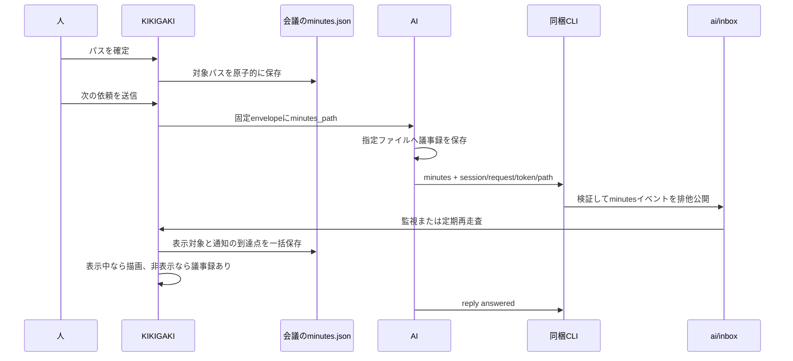

# 議事録プレビューの設計

議事録の受け渡しの契約をまとめる。右ペインの操作と表示は [議事録ペイン](minutes-pane.md)、本文の描画は [議事録の描画と検索](minutes-rendering.md)、録音開始シートとURLスキームは [録音開始シート](start-sheet.md) を参照する。既存の送信・返送契約は [AI参加者の設計](ai-participant.md)、複数宛先の契約は [AIプロファイル](ai-profiles.md) を参照する。

## 決定済みの動作

- プレビューは「対象なし」で始まる。既定の議事録パスを設けず、会議開始だけでは議事録ファイルを生成しない。
- 人が指定したパスは、以後の送信envelopeの `participant.minutes_path` へ絶対パスで渡す。既存requestは変更しない。
- AIが議事録を作成・更新したら、同梱CLIの `minutes` でパスを通知する。アプリは対象を切り替える。非表示なら開かず、フッターに「議事録あり」を出す。
- 場所は任意。アプリがCodexへ追加する書き込み許可は `outputDir` までで、選択された任意のパスを追加しない。

プレビューは閲読用であり、パス欄の操作で議事録本文を書き換えない。議事録は文字起こしの会議Markdownとは別の成果物であり、`minutes` は会議Markdownへの追記も行わない。

## 既存コードと責務の分担

| 既存箇所 | 責務 |
| --- | --- |
| `AIParticipantContext` / `AIEnvelope` | 固定requestの契約へ任意のパスを追加し、Coreで形式検証する。 |
| `AIReceiveEvent` / `AIQuestion` | 現状はacceptとresultの固定枠。議事録通知をresultに混ぜず、別の `AIMinutesEvent` として扱う。 |
| `ReturnCommand` / `AIFileStore` / `AIInbox` | sessionとrequestの照合、fdでの検証、排他公開を再利用する。新しい通信経路やtokenを作らない。 |
| `AIConversationController.scan` | 既知requestのminutesも回収し、会議の議事録状態へ渡す。受領基準や質問の状態を更新しない。 |
| `MinutesStore` / `AIRecordStore` / `MeetingSession` | 会議IDごとに1つのMainActorのstoreをアプリ全体の辞書で共有し、人の指定と通知の回収を直列化する。 |
| `TranscriptWindow` | 現在表示中の会議へプレビューを接続する。 |
| `AIInboxMonitor` | fdの同一性確認とTimerの再走査を、議事録ファイルの監視へ応用する。 |

既存manifestはAIプロファイルを必須にし、AI利用開始時に初めて作る。人だけで使うプレビューをその生成条件へ結び付けないため、議事録のmanifest相当情報を同じ会議の `ai/minutes.json` へ分ける。パスの正本はこの1か所にし、既存 `ai/manifest.json` へ複製しない。

## 両方向の受け渡し


```mermaid
sequenceDiagram
    participant H as 人
    participant A as KIKIGAKI
    participant S as 会議のminutes.json
    participant I as AI
    participant C as 同梱CLI
    participant B as ai/inbox
    H->>A: パスを確定
    A->>S: 対象パスを原子的に保存
    H->>A: 次の依頼を送信
    A->>I: 固定envelopeにminutes_path
    I->>I: 指定ファイルへ議事録を保存
    I->>C: minutes + session/request/token/path
    C->>B: 検証してminutesイベントを排他公開
    B->>A: 監視または定期再走査
    A->>S: 表示対象と通知の到達点を一括保存
    A->>A: 表示中なら描画、非表示なら議事録あり
    I->>C: reply answered
```

`minutes_path` が無ければ、AIは依頼文から書き先を決める。通知後はそのパスがプレビュー対象になる。通常はenvelopeに載せるのは人が指定したパスだけであり、別プロファイルの通知でAIの書き先を変更しない。例外として `board_heading` が固定されたボードの会議では、人の指定が無いとき通知パスを以後の手動・自動envelopeへ渡す。詳細は [議論のボード](board.md)。パスだけで議事録作成の依頼・作業許可・ファイルの実在を推定しない。

### envelope

`participant.minutes_path` は省略可能な文字列。既存のparticipant版1へ追加し、旧requestの欠損は対象なしとする。明示nullや文字列以外は拒否する。非指定時はキーを省略し、空文字を出さない。

パスは `/` 始まりで、NUL・制御文字・改行を含まないローカルの `.md` ファイル名とする。UTF-8で1024バイト以下。拡張子は大文字小文字を区別しない。先頭以外の空要素、`.`、`..`、末尾 `/`、経路要素 `.kikigaki-context` をCoreとCLIで拒否する。JSONとCLIは `~`、相対パス、file URLを受け取らない。同一性はSwiftの文字列としての等価性で、symlink解決先や大文字小文字の違いを同一視しない。Coreは実在・読み書き権限を調べず、`AIEnvelope.validate` から参加者の検証へ到達させる。既存のenvelope全体のサイズ上限は維持する。

このパス検証規則は以後強化しない。保存済みstateの復号でも全requestを検証するため、強化は過去会議の読込を壊す。現在の会議の `.md` との一致は会議URLを持つアプリ側で拒否する。

管理領域 `.kikigaki-context` の要素比較はASCIIの大文字小文字を区別しない。`controlCharacters` はZWJなどの書式文字も拒否する。後からこの制限を緩めることは許容する。Swiftの文字列比較はNFCとNFDを同一視するため、バイト列の完全一致ではない。

UIは `~` 展開と字句的なパス正規化を行ってからこの検証へ渡す。空欄の確定は対象解除。新規ファイルはまだ存在しなくても指定できる。解決不能な記法はパス欄でエラーにし、直前の対象を維持する。

手動・自動・確認質問への返答・再送のすべてで、送信操作の入口の `capturedAt` と同じ位置、最初のawaitより前に人の指定パスを採取する。確定待ちや起動中に対象を変えても、その送信のrequestへ後付けしない。明示nullの拒否は `trigger` と同様、キーの存在確認後に非Optional文字列としてdecodeする。

### CLIと受信箱イベント

```text
<cli_path> minutes --session <session_path> --request <request_id> --token <request_token> --path <絶対パス>
```

stdinは読まない。4つの必須引数以外、重複引数、空の値を拒否する。`session_path` は既存どおり単一・複数プロファイルの両方の形を認め、階層、世代、会議ID、provider整合、固定requestのsessionパスとrequest tokenを照合する。session tokenでrequest tokenを代用しない。Codexのthread identity保存もaccept/replyと共通の経路を通す。

通知するパスの形式はenvelopeと共通。CLIは議事録本文を開かず、存在確認や本文のコピーをしない。議事録に0600を要求せず、受信箱の所有者・権限の検証と区別する。CLI成功は通知の保存を意味し、議事録作成やアプリでの表示成功を意味しない。

`AIMinutesEvent` の形式を以下に固定する。例の日時は書式の例であり作業記録ではない。

```json
{
  "schema_version": 1,
  "event_id": "11111111-1111-4111-8111-111111111111/minutes",
  "kind": "minutes",
  "meeting_id": "22222222-2222-4222-8222-222222222222",
  "request_id": "11111111-1111-4111-8111-111111111111",
  "session_generation": 1,
  "snapshot_id": "33333333-3333-4333-8333-333333333333",
  "recorded_at": "2026-01-01T00:00:00.000Z",
  "minutes_path": "/Users/example/Documents/notes/定例.md"
}
```

- ファイル名は `<request_id>.minutes.json`、event IDは `<request_id>/minutes`。UUIDの表記は既存のSwift生成形式に揃える。
- 1 requestにつき通知するパスは1つ。同じrequest・同じパスの再実行は成功し、保存時刻の差を同一性に含めない。異なるパスで再実行したら競合エラーにする。定期更新は次requestの通知と、同じファイルの監視で扱う。
- イベントにtoken、議事録本文、`context_received`、回答のbodyやreasonを載せない。minutesは受領・回答・作業成功の代わりにならない。
- 既存の `AILimits.eventBytes` を適用し、通常ファイル・所有者・0600・`st_nlink == 1` を検証する。専用階層は0700、symlinkとFIFOを拒否し、fdを辿る既存検証を共有する。
- 公開は既存 `AIFileStore.write(replacing: false)` の一時ファイル、fsync、close、link、仮名unlink、親fsyncの順を維持する。二重呼出しでは既存内容を検証して親fsync後に成功を返す。
- 終了コード0とstdoutのevent IDが成功。保存失敗・競合・不正入力は既存CLIの非0終了を使い、完成していないイベントを受理させない。

`reply --kind minutes` は認めない。既存のaccept/resultファイル名、`AIReceiveEvent` の版、固定requestファイルは変えない。旧アプリは新イベントファイルを無視でき、旧requestは新キーなしで引き続き読める。

## 会議ごとの保存と回収

議事録専用のmanifest相当ファイルは `<outputDir>/.kikigaki-context/<meeting_id>/ai/minutes.json`。Coreの `MinutesState` とAIIOの保存adapterで読み書きする。

| 項目 | 型・契約 |
| --- | --- |
| `schema_version` | 整数1。未知版は読めない旨を表示する。 |
| `meeting_id` | 親階層と一致するUUID。 |
| `minutes_path` | 任意文字列。プレビュー対象。未指定は省略し、対象なし。 |
| `human_minutes_path` | 任意文字列。人が指定した書き先。envelopeでは最優先。ボードの会議だけ、未指定ならminutes_pathで補う。 |
| `target_changed_at` | 対象を最後に変更したISO8601日時。人の対象解除でも更新する。初期状態は省略。 |
| `target_source` | `human` または `ai`。対象なしなら省略。ファイルなしの案内を区別する。 |
| `last_event` | 任意の `{recorded_at, event_id}`。回収の到達点。時刻、同値ならIDの辞書順で比較する。 |
| `revision` | 比較更新用の0以上の整数。保存成功ごとに増やす。 |

ファイルが無ければ空状態として扱う。壊れた・未知版のファイルは警告を出し、通知を適用しない。人が明示的にパスを確定した場合だけ `minutes.json.broken-<日時>` へ衝突しない名前で退避して再作成し、人の操作時刻を新しい基準にする。退避に失敗したら上書きしない。既存AI manifestの版1・版2と既存会議は無変換で読める。

全更新はアプリ全体で会議IDごとに唯一のMainActorの `MinutesStore` へ渡す。AI未使用の会議も同じ辞書から取得する。保存直前にファイルを読み直し、取得時のrevisionと異なれば新しい状態へ操作を再適用する比較更新にする。人の指定・controller・再起動回収が別々の古い写しを保存してはならない。

回収は送信試行済みの既知requestに対応する通知だけを対象にする。固定requestとのID・snapshot・世代照合を `AIInbox` の共通読取検証で行う。返送時tokenの検証はCLI、受信側は検証済みrequestとの対応と私有受信箱のfd検証を担う。生tokenを通知へ持ち回らせない。

1. 通知を走査し、`recorded_at`、同値ならevent IDの昇順で処理する。到達点以下は再適用しない。
2. `recorded_at` が `target_changed_at` より古い通知は到達点を進めるだけにする。それ以外は表示対象と変更時刻を更新し、人の書き先は維持する。対象と到達点を原子的に保存する。
3. 保存成功後に画面と次回送信用の状態へ反映する。保存失敗なら対象は変えず、受信箱を残して再試行する。

人の指定は表示対象と人の書き先を同時に変更し、対象解除も両方を空にする。到達点は維持し、`target_changed_at` を更新する。遅れて届いた古い通知も巻き戻しを起こさない。人の指定より後に記録された通知は表示対象だけを切り替える。複数プロファイル間でもプレビュー対象は会議につき1つ。

旧世代・取消後・`work_allowed=false` の通知も、送信済みの既知requestへ正しく対応するなら元会議へ回収し、同じ時刻基準を適用する。新会議の対象や質問状態は変えない。複数AIによる議事録本文の同時編集を調停する機能は持たない。

起動直後と会議の準備中でstoreが無い間の指定は、メモリに保留して開始する会議へ引き継ぐ。適用済みの保留は消す。録音開始シートとURLスキームの指定は、停止後も残る前の会議のMarkdownへ当てない預け先(`prepareMinutes`)を経由する。経路の詳細は [録音開始シート](start-sheet.md) を参照する。

適用失敗の自動試行は1回だけとし、storeの警告を残して人の再確定に任せる。停止後の指定は現在表示中の会議へ保存する。その後の新会議は、準備中に新たな指定がない限り前会議のパスを引き継がず対象なしに戻る。AI未設定でも人によるパス指定と保存・監視は使える。

対象範囲は現在の会議と、アプリ起動中に保持するAI会議の状態回収まで。完了済み会議の全件再走査、AI未使用会議や全履歴を開く導線は対象外とする。既存の未完了AI会議の再起動回収は維持し、`needsRecovery` へ未適用のminutesイベントを加える。結果が先に届いた場合もminutesの取込状態を見て登録簿を更新する。アプリ終了後に完了済み会議へ新たに届いた通知の発見は、全件走査を行わない範囲制約として残る。

到達点は1件だけを保持し、通知ごとのID配列は保存しない。`has_unseen_minutes` はメモリだけで持ち、回答の未読とは独立する。

形式は正しいがアプリが管理ファイルとして拒否する通知は、対象を切り替えず到達点だけを進める。警告は新たに処理した走査で1回表示する。一時的な読取失敗は再試行待ちとして分ける。`needsRecovery` は走査で判明した未適用通知の有無を保持した値で判定し、設定を読めない間は通知の有無にかかわらず回収登録を残さない。明示修復後は空の到達点から通知を判定し直す。壊れた設定の警告と修復導線は現在の会議のプレビューに限る。登録簿判定のたびに受信箱を再読込せず、次の監視走査で反映する。保存できなかった人の指定は、再試行時刻を採り直す。

親階層の欠損を未作成と解釈するのはminutes用のAIFileStoreだけとする。既存の受信箱走査・CLIでは `unsafe_file` の契約を維持する。CLIのminutesで指定パスが不正な場合は、本文やパスを含めない `invalid_path` を返す。

## 右ペインと描画

右ペインの開閉・パス欄・履歴・幅と復元・ファイルの監視は [議事録ペイン](minutes-pane.md) が正本。本文の描画と検索は [議事録の描画と検索](minutes-rendering.md) が正本。ここでは扱わない。

## Skillの規則と書き込み許可

`skills/kikigaki/references/meeting.md` に、議事録の書き先と通知の規則がある。契約の要点は次のとおり。

- `participant.minutes_path` があれば、議事録はその絶対パスのファイルへ書く。無ければ置き場は依頼文に従う。パスの存在だけで作業を開始せず、依頼と `work_allowed` に従う
- 議事録を保存できたら、answeredを返す前に同梱CLIの `minutes` へ実際の絶対パスを通知する。1 requestにつき通知するパスは1つで、minutesはacceptやreplyの代わりにならない。パス指定済みのボード更新だけは通知を省略する
- 保存に失敗したらminutesは送らず、`failed --reason work_failed` で原因と残った作業を返す。保存は成功したが通知に失敗した場合もその区別を返す
- `work_allowed` の説明では通知自体を連携操作に含める。falseのときに議事録を作成・更新してよいという意味にはしない

`AILaunchConfiguration` が `outputDir` をCodexの `sandbox_workspace_write.writable_roots` へ追加する。保持する既存許可先は `~/.codex/config.toml` 最上位の `[sandbox_workspace_write]` に限る。`CODEX_HOME` やプロファイル別の設定を拾わない既存の制約は変えない。任意に選択した議事録の親を追加したり、起動済みCLIの権限を変更したりしない。

受け入れたリスク: outputDirへの許可は、全会議のMarkdown、state、archive、minutes、tokenを含むrequestsをモデルから書き換え可能にする。会議Markdownを直接編集しない制約はSkillの規則であり、サンドボックスの境界では保証されなくなる。tokenは同じユーザー内での隔離ではない。この点は `CLAUDE.md` にも記載している。

Claudeの同梱CLI限定allowは維持し、cwd外の編集は利用者の権限設定によって承認待ちとなり、herdrでblockedとして見える。Codexのwork_failedと区別して検証する。

`outputDir` 外で、cwdや利用者の既存許可にも含まれない場所への書き込みは、CLIの承認の仕組み(Codexのサンドボックス外への昇格要求、Claudeの編集の承認待ち)に委ねる。利用者がペインで承認すれば保存は成功し、拒否されたときだけ `work_failed` で見える。Skillには「許可の範囲を先読みして諦めず、まず保存を試みる」と書く。場所を選ぶ操作は無条件の書き込み権限の付与ではない。
    - 経緯: 初版のSkillは「許可外なら `work_failed` を返す」と読める文言で、AIが保存を試みる前に諦め、機能追加前には承認経由で書けていた `~/Documents/minutes` へ書けなくなった

この制約は `CLAUDE.md` の「変える前に知っておくこと」とREADMEの関連箇所にも記載している。

設計時の段ごとの検証とレビューの記録は [議事録プレビューの実装記録](records/minutes-preview-implementation.md) を参照する。
