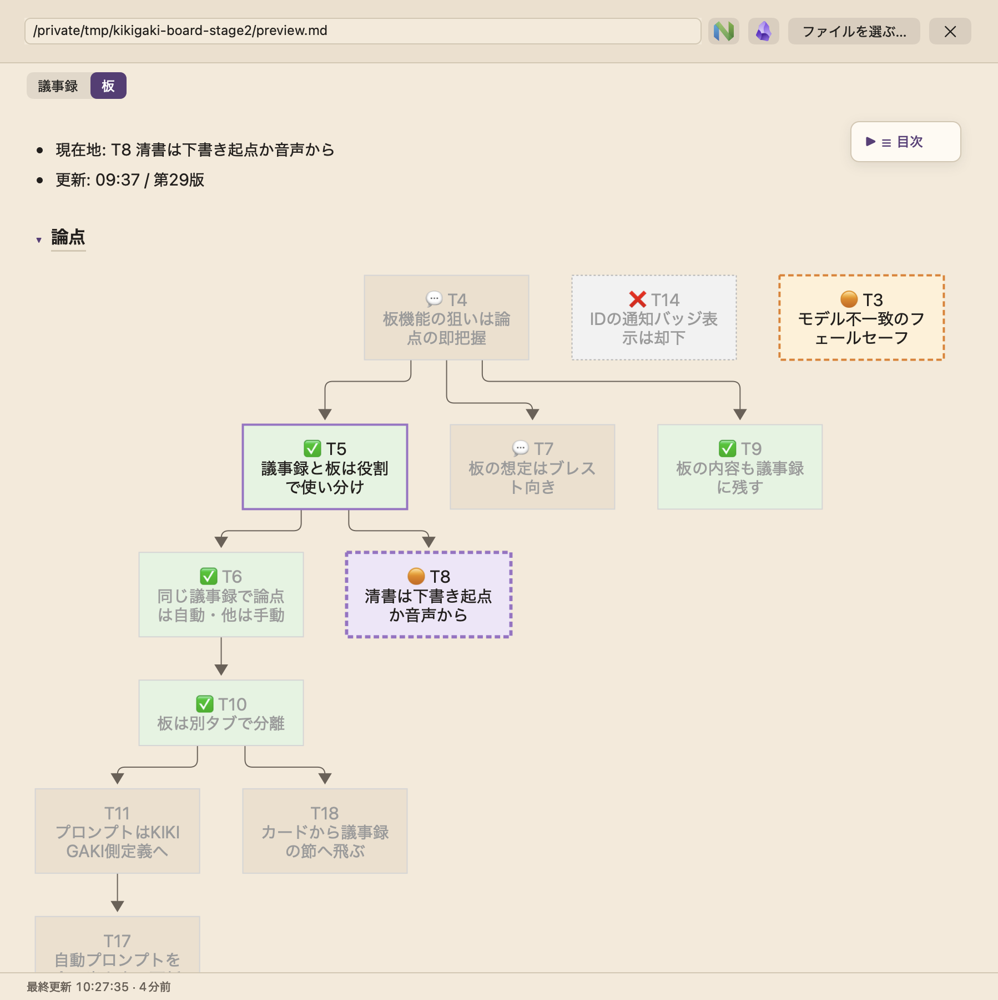
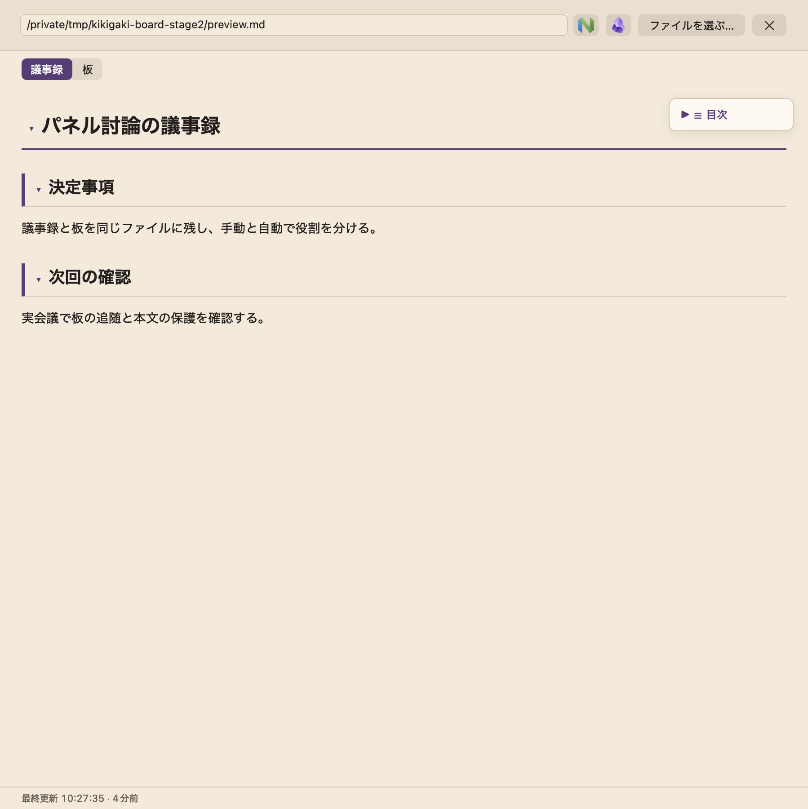

# 議論のボードの検証記録と受入手順

2026-09-22に行った、議論のボードの検証の記録と、受入手順。現行の仕様ではない。現行は [議論のボード](../board.md) を参照する。

節は実施の時系列に並べる。各節の「未確認」や「未実行」は、その時点の状態を表す。後の節で解消したものには注記を付けた。

## 第2段導入時

2026-09-22に検証。`swift build` 成功、`swift test` 全724テスト成功。Web描画器の `npm test` は15テスト成功。

Coreで設定の正常・型違い・空・重複、内蔵文面の機械照合、コードフェンス内の偽見出し、同階層以上の境界、末尾追加、NFC/NFD、CRLF、任意envelopeの省略と明示null、会議Markdownの要約を確認した。アプリでは開始シートのパス必須、会議設定の復元と保存競合、別宛先への手動送信の見出し保護、別タブの本文分離、見出し消失時のタブ非表示、実Mermaidの内部カード移動と外部click無効を確認した。

`./scripts/make-app.sh` で組んだアプリの `--preview-minutes` で両タブを撮影。第1段の第29版を作業用Markdownへ複製し、ボードより深い見出しに調整して使った。12論点では縦スクロールが必要だった。




## 実herdrを使うreplay(第2段導入時)

指定された `2026-09-14_0044.wav` の試験は未実行。自動承認レビューが音声由来データの外部Codex送信を拒否し、発注文の明示指定を示した再審査でも拒否された。音声は送信していない。

安全な代替として、ffmpegで生成した無音WAVと架空の手入力2件だけを使う試験を実行した。設定と保存先は `/private/tmp/kikigaki-board-stage2` に隔離した。実herdrのworkspace作成、内蔵プロンプト入りの固定request作成、`board_heading` と `minutes_path` の受け渡し、`minutes.json` の見出し固定、会議Markdownの要約は確認できた。ただしCodex起動が `agent_not_ready` で失敗し、AIへの送信・受領・ファイル実更新・answeredの往復は確認できなかった。録音停止後に自分のAIペインが閉じるところは確認した。既定cwdでの再試行も自動承認レビューに拒否され、未実行。

> 注記: 指定音声の試験とAIの往復の未確認は、後の「時刻付き見出しと図先頭への変更」で解消した。指定音声 `2026-09-14_0044.wav` のreplayでCodexへ2回送信し、answeredの回収とファイル更新を確認している。

証跡:

- `/private/tmp/kikigaki-board-stage2/synthetic-replay.log`
- `/private/tmp/kikigaki-board-stage2/output/.kikigaki-context/E347F2F2-9969-4FB7-9033-F757DEC27C56/ai/`
- `/private/tmp/kikigaki-board-stage2/output/2026-09-22_1028.md`

## boardLocation対応

`./scripts/make-app.sh` のビルドと署名が成功。`swift test` 全728件成功。初回の全体実行では既存の接続待機テスト1件がtimeoutとなり、同じ全体の再実行で成功した。

設定の孤立・不正値・合成後のサイズ上限、内蔵と独自プロンプトへの条件付き付与、変数の非展開、開始の3経路を検証する。結合テストでは初回のパス省略、minutes通知の回収、target_sourceがaiのままの保存、2回目のパス受け渡しと作成指示の除去、手動送信へのパスと保護見出しの受け渡し、通知したファイルのタブ表示を確認する。

実音声replayは自動承認レビューにより起動前に拒否された。理由は「replayにより指定音声由来の内容を外部AIへ送信する高リスクのデータ外部送信ですが、この評価で信頼できる明示的な送信許可は確認できません」。発注文には実施許可があったが、アプリは起動できていない。実AIによるファイル作成・minutes通知・第2版以降の継続更新は未確認。作成ファイルと版数は無い。代替replayで検証済みとは扱わない。

> 注記: 実AIによるファイル作成・minutes通知・第2版以降の継続更新の未確認は、次の「時刻付き見出しと図先頭への変更」で解消した。Codexが1回目に作成し、minutes通知の後、2回目に同じファイルを更新している。

作業用configは `/private/tmp/kikigaki-board-location.N5tP9R/config.toml`、保存先はその隣の `output/` に隔離した。boardLocationも同じoutput配下を指定した。既存の利用者configと録音・議事録は変更していない。インストール済みSkillが旧版のため、試験configのpromptではビルドした.app内のSkillを読むよう明示した。

## 時刻付き見出しと図先頭への変更

2026-09-22に `swift build`、`swift test` 全731件、`web/minutes` の `npm test` 15件が成功。`./scripts/make-app.sh` のビルドと署名も成功。時刻の飾りの有無・不正な接尾辞・NFC/NFD・CRLF・見出し行ごとの差し替え・内蔵全文の照合・時刻付き見出しのタブ分離を検証した。JSは変更していない。

指定音声 `2026-09-14_0044.wav` を約10倍速replayし、内蔵プロンプトをCodexへ2回送信してansweredを回収した。1回目は `## ボード(18:06 更新)` で作成し、2回目は同じファイルの見出しを `## ボード(18:07 更新)` へ更新した。実ファイルの見出しはNFD表記で、設定のNFC表記と同じ対象として認識した。両方とも見出し直後がMermaid図、その後が立場、最下部が直近の動きとなり、概要行・「論点」見出し・版数は無い。minutes通知後の2回目には同じminutes_pathが渡った。

実生成ファイルを署名済み.appで開き、ボードタブが出て図から始まることを撮影で確認した。別途、前後に議事録本文を持つ検証用Markdownで両タブの分離も撮影した。見出し行と更新時刻は元Markdownに残し、既存どおりボードタブには配下だけを表示する。AIペインの終了を確認した後、起動したreplayプロセスだけをPIDで停止した。音声認識の精度や実会議中の視認性はこの試験の対象外。

証跡は `/private/tmp/kikigaki-board-clock.9oFRdz/` に保存した。`config.toml` と `output/` を隔離し、利用者の既存config・録音・議事録は変更していない。

- `board-first.md` と `board-second.md`: 各更新後の実ファイル
- `replay.log` と `output/.kikigaki-context/`: replayのログと固定request・返送
- `replay-capture/`: 実生成ファイルの両タブ
- `capture/`: 前後の議事録本文を含む検証用Markdownの両タブ

## 全体図と詳細図への分割

- 2026-09-22に `swift build`、Swift全732件、Web描画器16件が成功した。
    - 検証: 内蔵全文の機械照合、Vault内外の見出しリンク、%を含む見出し、ボード内のリンク行とカードの実クリック。
    - 回帰: ボード外の見出しは議事録タブへ移動し、他ノートのWikiリンクはVault内だけObsidianへ渡す。
- `npm run build` で配布JSを再生成した。
- `./scripts/make-app.sh` でビルド・署名後、`--preview-minutes` で撮影した。
    - 入力: 全体図と2枚の詳細図に13論点を置いた `/private/tmp/kikigaki-board-detail.qaKFOG/fixture.md`。
    - 表示: `capture/board.png` に全体図直後のリンク行、`capture/board-link.png` にクリック後の「提供地域の詳細」の着地強調を保存した。
    - 証跡のルート: `/private/tmp/kikigaki-board-detail.qaKFOG/`。
    - 対象外: AIによる実生成のreplayとObsidianアプリ上の操作。

撮影時に `KIKIGAKI_DEBUG_BOARD_ANCHOR="提供地域の詳細"` を追加すると、リンク行のクリックと見出しへの着地を検証し、`board-link.png` も保存する。

## 受入手順

上の検証をまとめた、手動での受入確認の手順。

1. `./scripts/make-app.sh` を実行する。
2. 作業用configへ[議論のボード](../board.md)の設定例を書き、outputDirとboardLocationを作業用へ向ける。開始シートでボードを選び、議事録欄が空でも開始できることを確認する。boardLocationも省略した設定では開始を拒否することを、開始シートと録音中の自動実行シートで確認する。
3. AIが作成したファイルをminutesで通知し、ai/minutes.jsonのtarget_sourceがai、board_headingが指定見出しになることを確認する。2回目以降の固定requestには同じminutes_pathが入り、作成指示が消え、同じファイルの見出し行の時刻が更新される。同じ分の更新では時刻表示は同じになる。「議事録」「ボード」を切り替え、本文と目次が分離し、ボードが図・立場・直近の動きの順であることを確認する。人が議事録パスを指定した場合は、初回からそのパスを使いboardLocationを付けない。
4. 手動実行で本文を更新し、ボードが保たれることを確認する。ボードの内部clickカードは議事録タブへ移り、対応する見出しへ着地する。
5. 録音を止め、最後の回答を待つ。会議の保存状態を読み直して同じ見出しのタブが復元することを確認する。

指定音声の送信を実行できる環境でのreplay例。AI側に現行Skillが導入され、cwdの初回信頼確認が済んでいる環境で実行する。MINUTES_PATHは設定しない。既定の約10倍速を使う。

```sh
env KIKIGAKI_DEBUG_AI_AUTO_PROFILE=ボード \
  KIKIGAKI_DEBUG_AI_AUTO_SECONDS=35 \
  KIKIGAKI_DEBUG_REPLAY_HOLD=240 \
  .build/KIKIGAKI.app/Contents/MacOS/KIKIGAKI --show-window \
  --config /private/tmp/kikigaki-board-location.N5tP9R/config.toml \
  --replay ~/Documents/KIKIGAKI/2026-09-14_0044.wav
```

`KIKIGAKI_DEBUG_AI_AUTO_PROFILE` は内蔵または設定のボードプロンプトを選び、本番の開始経路を通す。登録先もoutputDirへ隔離する。間隔はAUTO_SECONDSで注入する。パス指定ありの試験ではMINUTES_PATHを指定する。これらは通常起動では無視し、`--smoke --replay` で入力検証だけを行える。
