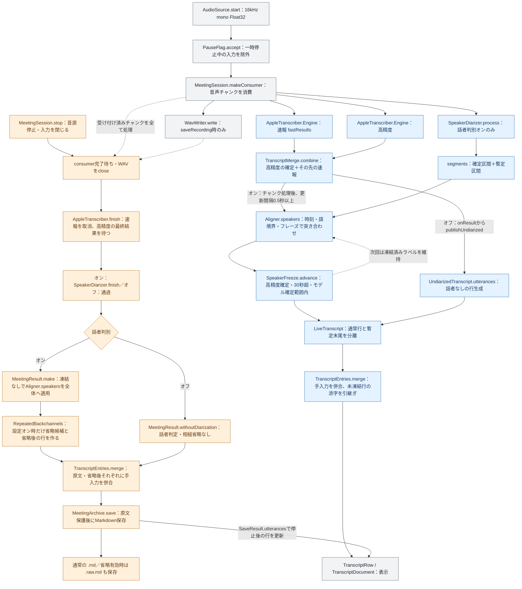
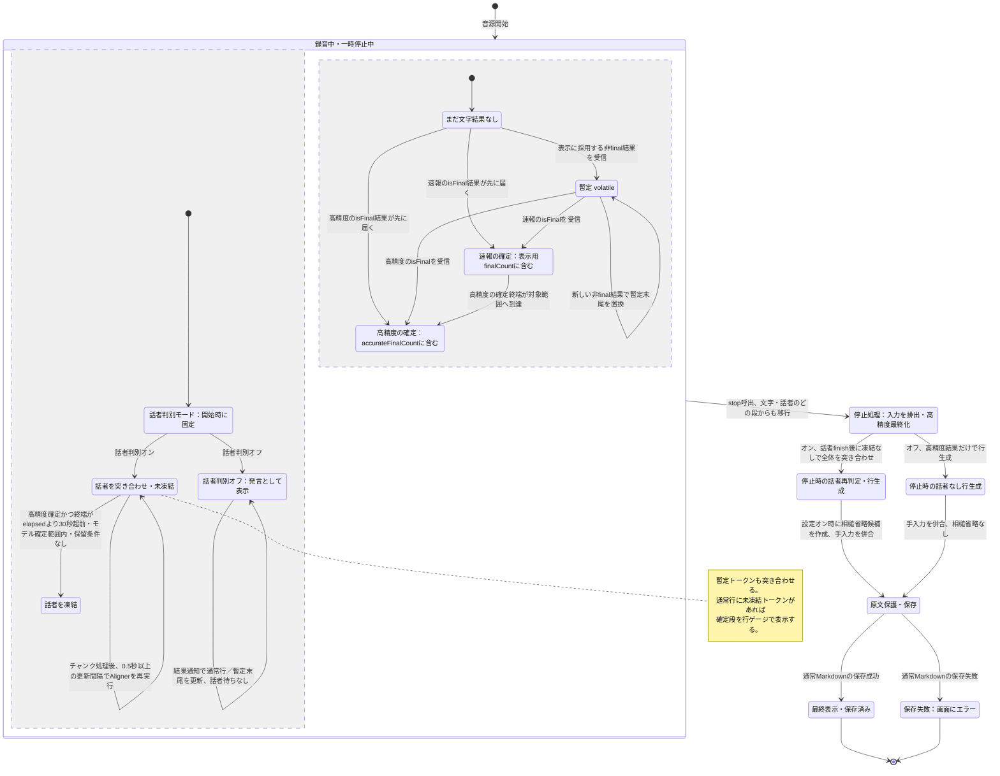

# 発話から文字・話者確定までのフロー

フローの土台は `2540a86` 時点のコード。行表示の説明には確定段ゲージの導入を反映している。文字の確定と話者の固定は別の状態であり、「確定」は認識の正しさを保証しない。録音中に固定した話者も、停止時には全体の突き合わせで変わり得る。

## 全体図

青は録音中の表示経路、橙は停止時の最終処理、灰は共通の入力・表示。矢印はデータの受け渡しを表す。同じ音声チャンクの投入順はWAV、話者エンジン、文字起こしで、3エンジンの結果が同時に届く意味ではない。

話者エンジンの出力は `TranscriptMerge` へ入らず、合成された文字と `Aligner` で合流する。速報の準備に失敗した会議では `CombinedStore.snapshot` が高精度の確定・暫定をそのまま返し、`TranscriptMerge.combine` を通らない。

停止時の `SpeakerDiarizer.finish` は、既定のHigh Contextで未処理の末尾チャンクを判定できるよう話者エンジンだけに無音を足す。WAV・文字起こし・会議時間は延長せず、返す話者区間を実音声の終端で切る。全体再判定は取得済みトークンと話者区間の再突き合わせであり、全録音をモデルへ再投入する処理ではない。

## 1つの発話が辿る状態遷移

以下は発話に含まれるトークン範囲に着目した図。文字と話者は並行して変化するため、録音中の枠を2領域に分けた。確定数・凍結数・行添字から読み取った状態であり、行ゲージの表示専用enumもこの観測から導出する。速報から高精度への置換で本文・トークン数・行境界も変わるため、同じ行が最後まで残るとは限らない。

速報の確定は高精度の確定を待つ前から突き合わせ対象になる。高精度の確定から初めて話者推定が始まる、という順序ではない。速報利用時の高精度の暫定結果は表示へ合成しない。

凍結は先頭から連続するトークン列を伸ばす処理で、次の条件をすべて満たしたところまで進む。

- `index < accurateFinalCount`。速報確定と暫定は対象外。
- `token.end < elapsed - 30`。ちょうど30秒前の終端はまだ対象外。
- `token.end <= diarizer.finalizedDuration`。モデルがまだ確定予測していない範囲を先に凍結しない。
- 0.8秒を超える長さのトークンで、文字・数字が1文字だけの場合、後続の高精度確定範囲に文字・数字を含むトークンが必要。なければその位置から先を保留する。

根拠: [SpeakerFreeze.advance](../Sources/KikigakiCore/SpeakerFreeze.swift)。`elapsed` は消費済み音声のサンプル数から計算し、一時停止中の壁時計の経過は加算しない。凍結済みでも後続の未凍結トークンと同じ行にまとまれば、行全体のゲージは最も未確定側の段を示す。

最終化に失敗しても `stop` は取得済みの高精度の確定・暫定を保存へ回す。話者の最終化失敗時も取得済み区間を使う。図の「保存済み」はファイル保存の成功であり、エンジン最終化の成功や文字・話者の正解を意味しない。通常Markdown保存前に原文保存が失敗した場合は相槌省略を中止し、その会議では以後も原文を表示・保存する。

## 図と実コードの対応

| 段・データ | 型・関数 | ファイルと役割 |
| --- | --- | --- |
| 音声入力・任意の録音保存 | `AudioSource.start`、`MicSource.start`、`FileSource.start`、`WavWriter.write` / `close` | [AudioSource.swift](../Sources/Kikigaki/AudioSource.swift)。音源から16kHz mono Float32を渡す |
| 受付・投入・更新周期 | `PauseFlag.accept`、`MeetingSession.start` / `makeConsumer` | [MeetingSession.swift](../Sources/Kikigaki/MeetingSession.swift)。受付時に一時停止を除外し、単一消費タスクで処理 |
| 速報・高精度の結果保管 | `AppleTranscriber.Engine`、`ResultStore.apply`、`CombinedStore.apply` / `snapshot` | [AppleTranscriber.swift](../Sources/Kikigaki/AppleTranscriber.swift)。`isFinal` は確定列へ追記、非finalは最新の暫定列へ置換 |
| 文字の合流 | `TranscriptMerge.combine`、`Snapshot.finalCount` / `accurateFinalCount` | [TranscriptMerge.swift](../Sources/KikigakiCore/TranscriptMerge.swift)。高精度確定prefixの終端以降に開始する速報だけ採用 |
| 話者区間・確定予測範囲 | `SortformerModelStore.config`、`SpeakerDiarizer.process` / `segments` / `finalizedDuration` | [SpeakerDiarizer.swift](../Sources/Kikigaki/SpeakerDiarizer.swift)。既定High Context、確定と暫定の区間を返す |
| 時刻の突き合わせ | `Aligner.speakers` / `speaker` / `smoothSpeakers` / `phraseRanges` | [Aligner.swift](../Sources/KikigakiCore/Aligner.swift)。窓判定、語内補正、フレーズ多数決、短い別話者区間の扱い |
| 長い語頭の補正 | `SpeechTail.speakers` / `evidenceWeights` | [SpeechTail.swift](../Sources/KikigakiCore/SpeechTail.swift)。トークン中央の窓判定を基に、長い1文字の末尾の声と後続文字を照合 |
| 語境界・短い返答の保持 | `WordBoundaries.init`、`tokenRanges`、`containsWholeWords` / `containsMeaningfulReply` / `isBackchannel` | [WordBoundaries.swift](../Sources/KikigakiCore/WordBoundaries.swift)。フレーズ全文の語境界を使い、ASRトークン自体は分割しない |
| 録音中の凍結 | `SpeakerFreeze.advance`、`graceSeconds` | [SpeakerFreeze.swift](../Sources/KikigakiCore/SpeakerFreeze.swift)。高精度確定・音声時刻・モデル確定範囲で凍結数を制限 |
| 表示用の行と暫定末尾 | `LiveTranscript.init`、`Aligner.utterances` / `utteranceTokenRanges` | [LiveTranscript.swift](../Sources/KikigakiCore/LiveTranscript.swift)、[Aligner.swift](../Sources/KikigakiCore/Aligner.swift)。`finalCount` まで通常行、その先を `tentativeText` へ。未凍結を含む行を `pendingSpeakerRows` へ |
| 話者判別オフの経路 | `MeetingSession.publishUndiarized` / `flushUndiarized`、`UndiarizedTranscript.utterances` | [MeetingSession.swift](../Sources/Kikigaki/MeetingSession.swift)、[UndiarizedTranscript.swift](../Sources/KikigakiCore/UndiarizedTranscript.swift)。結果通知で更新し、話者ラベルはnil、未凍結行集合は空 |
| 話者統合の反映 | `SpeakerMapping.apply`、`MeetingSession.refreshLive` | [SpeakerMapping.swift](../Sources/KikigakiCore/SpeakerMapping.swift)、[MeetingSession.swift](../Sources/Kikigaki/MeetingSession.swift)。録音中は推定・凍結後のラベルへ統合設定を適用 |
| 手入力の併合 | `TranscriptEntries.merge` | [TranscriptEntries.swift](../Sources/KikigakiCore/TranscriptEntries.swift)。声の判定・行生成後に手入力を混ぜ、未凍結行の添字を更新 |
| 画面の更新 | `MeetingSession.publishLive` / `refreshLive`、`TranscriptWindow.updateRows`、`TranscriptRow.update` / `updateTentative`、`TranscriptDocument.setRows` / `reflow` | [MeetingSession.swift](../Sources/Kikigaki/MeetingSession.swift)、[TranscriptWindow.swift](../Sources/Kikigaki/TranscriptWindow.swift)、[TranscriptRow.swift](../Sources/Kikigaki/TranscriptRow.swift)、[TranscriptDocument.swift](../Sources/Kikigaki/TranscriptDocument.swift)。状態はSessionから渡し、Documentは行を配置 |
| 停止・エンジン最終化 | `MeetingSession.stop`、`AppleTranscriber.finish` / `tokens`、`SpeakerDiarizer.finish` / `cleanup` | [MeetingSession.swift](../Sources/Kikigaki/MeetingSession.swift)、[AppleTranscriber.swift](../Sources/Kikigaki/AppleTranscriber.swift)、[SpeakerDiarizer.swift](../Sources/Kikigaki/SpeakerDiarizer.swift)。消費完了後に高精度、話者の順で最終化 |
| 全体再判定・最終行 | `MeetingResult.make` / `withoutDiarization` | [MeetingResult.swift](../Sources/KikigakiCore/MeetingResult.swift)。オンは凍結なしでAlignerを呼び、統合設定を反映。オフは話者なし行を生成 |
| 繰り返し相槌の省略 | `RepeatedBackchannels.candidates` / `utterances` | [RepeatedBackchannels.swift](../Sources/KikigakiCore/RepeatedBackchannels.swift)。有効時だけ候補を省いた行を別に作る |
| 原文保護・Markdown保存 | `MeetingSession.save`、`MeetingArchive.save`、`MeetingMarkdown.render` | [MeetingSession.swift](../Sources/Kikigaki/MeetingSession.swift)、[MeetingArchive.swift](../Sources/KikigakiCore/MeetingArchive.swift)、[MeetingMarkdown.swift](../Sources/KikigakiCore/MeetingMarkdown.swift)。保存結果の行を停止後の画面へ返す |

突き合わせ内部の順序は、凍結済みprefixの維持 → `SpeechTail` による窓判定と長い語頭の補正 → 補正前の重みでフレーズ多数派を決定 → 語内の文字多数決 → 短い区間の保持・吸収 → 句読点を直前の話者へ付与、となる。トークンの本文を省く処理は停止時の `RepeatedBackchannels` に分かれている。詳細は [語頭・語尾補正](speaker-boundaries.md)、[短い返答](short-speaker-turns.md)、[議事品質の改善計画](minutes-quality-plan.md) を参照。

相槌省略は「うん」または「そう」の同語2回以上の連続で、同一フレーズ内・1.5秒未満などの条件を満たす候補に限る。直後に同じ話者の本文が続き、窓判定の時間重みの過半数が別の同一話者であることも必要。不明や同点を削除根拠にしない。詳細は [繰り返し相槌](repeated-backchannels.md) を参照。

## 時間の目安

| 対象 | 数値・条件 | 出典・読み方 |
| --- | --- | --- |
| 速報の結果 | 1〜3秒 | [AppleTranscriberの冒頭コメント](../Sources/Kikigaki/AppleTranscriber.swift)の実測記述。すべての発話に対する保証値ではない |
| 高精度の結果 | 約11.6秒分を蓄積、発話から6〜13秒遅れる | 同じコードコメントの実測記述。約11.6秒は各発話の固定の確定待ち時間ではない。現行の [fast-transcription.md](fast-transcription.md) にはこの秒数の記載がないため、出典をコードコメントとして明記する |
| 話者エンジン | 約30.4秒の出力遅延 | [SortformerModelStore.configのコメント](../Sources/Kikigaki/SpeakerDiarizer.swift)。既定のHigh Contextに関する値 |
| 話者の凍結猶予 | トークン終端が消費済み音声時刻より30秒超前 | [SpeakerFreeze.advance](../Sources/KikigakiCore/SpeakerFreeze.swift)。さらに高精度確定とモデル確定範囲、長い1文字の保留条件を満たす必要がある |
| オン時の画面反映 | 消費ループで前回更新から0.5秒以上経過したとき | [MeetingSession.makeConsumer](../Sources/Kikigaki/MeetingSession.swift)。独立タイマーではなく、チャンク処理後の判定。処理遅延もあり、表示までの上限ではない |
| オフ時の画面反映 | 確定数の増加は直ちに反映、その他の変化は0.5秒間隔へ集約 | [MeetingSession.publishUndiarized](../Sources/Kikigaki/MeetingSession.swift)、[話者判別の切替](diarization-toggle.md)。結果通知起点なので入力停止中も反映できる |

話者エンジンの約30.4秒と凍結猶予30秒を足して「発話後60.4秒で確定」とはしない。両方とも音声上の範囲に関わる別の条件で、コードはその条件が揃った先頭部分を凍結する。結果の受信時刻や凍結までの発話別実測値は、この文書では新たに測っていない。

行分割の秒数も待ち時間とは別である。オン時は話者の変化かトークン間1秒以上の間で行を分ける。オフ時は1秒以上の間、文末記号、または既に30秒以上ある行の次の結果ID境界で分ける。多数決に使うフレーズ境界はさらに別で、0.35秒以上の間、文末記号、または結果IDの変化と0.2秒以上の間で区切る。

## UIで見えている状態と見えていない状態

### 行で区別できる状態

| 内部の状態 | 今の表示 | 注意点 |
| --- | --- | --- |
| `tentativeText != nil` | 末尾の薄い文字、「聞き取り中…」、時刻なし | 話者別に分けない暫定末尾。速報利用時は速報の暫定、速報準備失敗時は高精度の暫定 |
| 通常行に未凍結トークンを含む | 通常の本文・推定話者と確定段のゲージ | 行右上の注記や未凍結を示す背景は出さない |
| 通常行の全トークンが凍結済み | ゲージが消える | 「確定」の文字や認識精度は表示しない。停止時には再判定され得る |
| 話者判別オフの通常行 | マイク記号と「発言」、高精度確定までは3段のゲージ | 話者が判明した意味ではなく、話者を判定しない会議 |
| オン時の話者ラベルがnil | 「?」 | 未凍結とは別の軸。「?」のまま凍結・最終表示になることもある |

### 内部状態と行ゲージの区別

| 内部の区別 | 行での表示と限界 |
| --- | --- |
| 速報の確定と高精度の確定 | アバター左のゲージで区別する。オン時は2段目と3段目が現在段となる。オフ時は速報確定が2段目、高精度確定でゲージが消える |
| モデル未判定・モデル暫定・モデル確定だが凍結猶予内 | モデルの到達範囲や段階は表示せず、文字の確定段と話者固定への到達をゲージで示す |
| 高精度待ち・猶予待ち・モデル確定範囲待ち・長い1文字の後続待ち | 凍結できない理由や残り秒数を表示しない |
| 一部だけ凍結した行と全体が未凍結の行 | どちらも行内の最も未確定側の段を示す。行内の凍結境界は表示しない |
| 録音中の凍結と停止後の再判定済み | 行単位の専用印はない。会議全体の録音状態・保存結果は別に表示する |
| 正しく認識した文字・話者と誤認識 | 確定・凍結は正誤の採点ではなく、UIにも正解保証はない |

「話者未確定」「コピーには含めません」の右上注記と話者未確定の薄い地は表示しない。暫定末尾の破線アバター・「聞き取り中…」・薄い本文と地は行の種類を示す。`TranscriptDocument` は渡された行を配置し、文字・話者の確定条件を判定しない。小音量による薄表示と除外注記は別の除外状態なので、薄さだけから文字・話者の確定を読み取らない。詳細は [小音量発話の除外](audio-exclusion.md) を参照。

ゲージの段だけの変化も点灯対象にしない。段の観測源と境界規則は [発話行のゲージ](utterance-progress.md) を参照。

図はプレビューのMermaid 12.0.0・`securityLevel: 'strict'` に合わせ、基本のノード・遷移・複合状態・並行領域と色定義を使用する。記法の参照は [Mermaidのflowchart](https://mermaid.js.org/syntax/flowchart.html) と [stateDiagram](https://mermaid.js.org/syntax/stateDiagram.html)。
