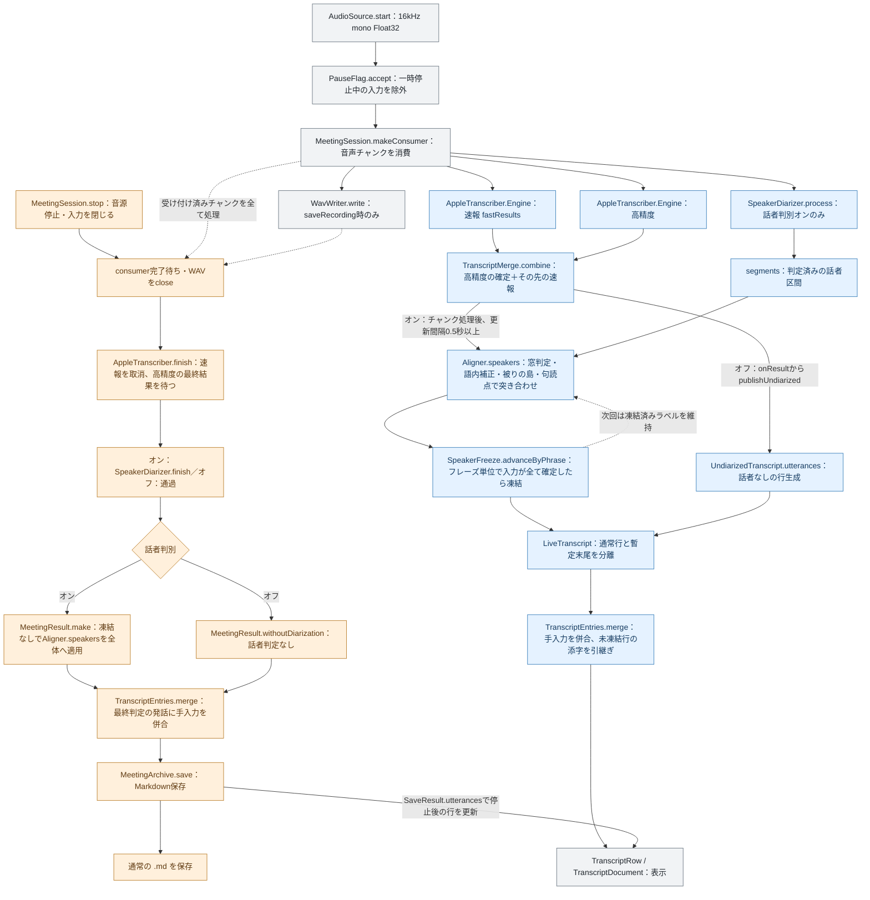
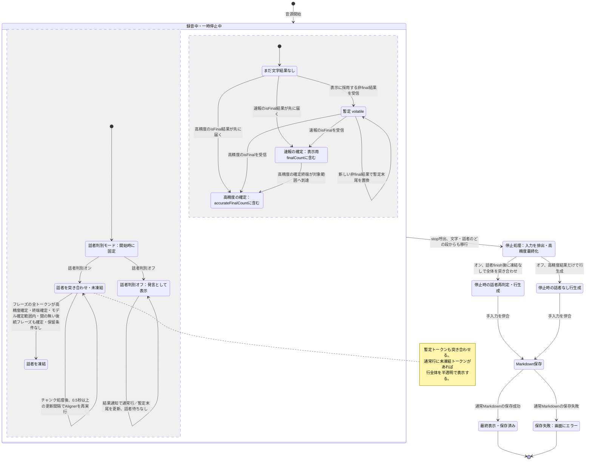

# 発話から文字・話者確定までのフロー

行表示の説明には半透明と通常の濃さによる2状態表示を反映している。文字の確定と話者の固定は別の状態であり、「確定」は認識の正しさを保証しない。録音中に固定した話者も、停止時には全体の突き合わせで変わり得る。

各段の仕様は次の文書が正本で、この文書は流れの図と実コードの対応だけを置く。

- 話者の補正の順序と凍結の条件: [話者の割当と固定](speaker-assignment.md)
- 速報と高精度の合流、時間の目安: [文字起こしの速報表示](fast-transcription.md)
- 行の半透明表示と確定の表示: [発話の確定表示](utterance-progress.md)
- 話者判別オフの経路と行分割: [話者判別の切替](diarization-toggle.md)
- 話者判別エンジン: [Nemotron fast128 への話者判別の切替](nemotron-integration.md)
- 小音量の除外: [小音量発話の除外](audio-exclusion.md)

## 全体図

青は録音中の表示経路、橙は停止時の最終処理、灰は共通の入力・表示。矢印はデータの受け渡しを表す。同じ音声チャンクの投入順はWAV、話者エンジン、文字起こしで、3エンジンの結果が同時に届く意味ではない。

```mermaid
flowchart TD
    audio["AudioSource.start：16kHz mono Float32"] --> accept["PauseFlag.accept：一時停止中の入力を除外"]
    accept --> consume["MeetingSession.makeConsumer：音声チャンクを消費"]
    consume --> wav["WavWriter.write：saveRecording時のみ"]
    consume --> fast["AppleTranscriber.Engine：速報 fastResults"]
    consume --> accurate["AppleTranscriber.Engine：高精度"]
    consume --> diarizer["SpeakerDiarizer.process：話者判別オンのみ"]
    fast --> merge["TranscriptMerge.combine：高精度の確定＋その先の速報"]
    accurate --> merge
    diarizer --> segments["segments：判定済みの話者区間"]
    merge -->|オン：チャンク処理後、更新間隔0.5秒以上| align["Aligner.speakers：窓判定・語内補正・被りの島・句読点で突き合わせ"]
    segments --> align
    align --> freeze["SpeakerFreeze.advanceByPhrase：フレーズ単位で入力が全て確定したら凍結"]
    freeze -.->|次回は凍結済みラベルを維持| align
    freeze --> live["LiveTranscript：通常行と暫定末尾を分離"]
    merge -->|オフ：onResultからpublishUndiarized| off["UndiarizedTranscript.utterances：話者なしの行生成"]
    off --> live
    live --> entries["TranscriptEntries.merge：手入力を併合、未凍結行の添字を引継ぎ"]
    entries --> ui["TranscriptRow / TranscriptDocument：表示"]

    stop["MeetingSession.stop：音源停止・入力を閉じる"] --> drain["consumer完了待ち・WAVをclose"]
    consume -.->|受け付け済みチャンクを全て処理| drain
    wav -.-> drain
    drain --> asrEnd["AppleTranscriber.finish：速報を取消、高精度の最終結果を待つ"]
    asrEnd --> speakerEnd["オン：SpeakerDiarizer.finish／オフ：通過"]
    speakerEnd --> finalMode{"話者判別"}
    finalMode -->|オン| realign["MeetingResult.make：凍結なしでAligner.speakersを全体へ適用"]
    finalMode -->|オフ| noDiarization["MeetingResult.withoutDiarization：話者判定なし"]
    realign --> finalEntries["TranscriptEntries.merge：最終判定の発話に手入力を併合"]
    noDiarization --> finalEntries
    finalEntries --> archive["MeetingArchive.save：Markdown保存"]
    archive --> md["通常の .md を保存"]
    archive -->|SaveResult.utterancesで停止後の行を更新| ui

    classDef common fill:#f1f3f5,stroke:#65717c,color:#20262c
    classDef recording fill:#e5f2ff,stroke:#337ab7,color:#153b60
    classDef stopping fill:#fff0dc,stroke:#b77924,color:#603b12
    class audio,accept,consume,wav,ui common
    class fast,accurate,diarizer,merge,segments,align,freeze,live,off,entries recording
    class stop,drain,asrEnd,speakerEnd,finalMode,realign,noDiarization,finalEntries,archive,md stopping
```

話者エンジンの出力は `TranscriptMerge` へ入らず、合成された文字と `Aligner` で合流する。速報の準備に失敗した会議では `CombinedStore.snapshot` が高精度の確定・暫定をそのまま返し、`TranscriptMerge.combine` を通らない。

停止時の `SpeakerDiarizer.finish` は、FluidAudio の `finishStream` で未処理の末尾チャンクを詰めて判定する。WAV・文字起こし・会議時間は延長せず、返す話者区間を実音声の終端で切る。全体再判定は取得済みトークンと話者区間の再突き合わせであり、全録音をモデルへ再投入する処理ではない。

## 1つの発話が辿る状態遷移

以下は発話に含まれるトークン範囲に着目した図。文字と話者は並行して変化するため、録音中の枠を2領域に分けた。画面で薄くする行も、同じ確定数・凍結数・行添字から導出する。速報から高精度への置換で本文・トークン数・行境界も変わるため、同じ行が最後まで残るとは限らない。

```mermaid
stateDiagram-v2
    state "録音中・一時停止中" as Recording {
        state "まだ文字結果なし" as NoText
        state "暫定 volatile" as Volatile
        state "速報の確定：表示用finalCountに含む" as FastFinal
        state "高精度の確定：accurateFinalCountに含む" as AccurateFinal
        [*] --> NoText
        NoText --> Volatile : 表示に採用する非final結果を受信
        NoText --> FastFinal : 速報のisFinal結果が先に届く
        NoText --> AccurateFinal : 高精度のisFinal結果が先に届く
        Volatile --> Volatile : 新しい非final結果で暫定末尾を置換
        Volatile --> FastFinal : 速報のisFinalを受信
        Volatile --> AccurateFinal : 高精度のisFinalを受信
        FastFinal --> AccurateFinal : 高精度の確定終端が対象範囲へ到達
        --
        state "話者判別モード：開始時に固定" as Mode
        state Mode <<choice>>
        state "話者を突き合わせ・未凍結" as Pending
        state "話者を凍結" as Frozen
        state "話者判別オフ：発言として表示" as Off
        [*] --> Mode
        Mode --> Pending : 話者判別オン
        Mode --> Off : 話者判別オフ
        Pending --> Pending : チャンク処理後、0.5秒以上の更新間隔でAlignerを再実行
        Pending --> Frozen : フレーズの全トークンが高精度確定・終端確定・モデル確定範囲内・間の無い後続フレーズも確定・保留条件なし
        Off --> Off : 結果通知で通常行／暫定末尾を更新、話者待ちなし
        note right of Pending
            暫定トークンも突き合わせる。
            通常行に未凍結トークンがあれば
            行全体を半透明で表示する。
        end note
    }
    [*] --> Recording : 音源開始
    state "停止処理：入力を排出・高精度最終化" as Finishing
    state "停止時の話者再判定・行生成" as Rejudge
    state "停止時の話者なし行生成" as FinalOff
    state "Markdown保存" as Saving
    state "最終表示・保存済み" as Saved
    state "保存失敗：画面にエラー" as SaveFailed
    Recording --> Finishing : stop呼出、文字・話者のどの段からも移行
    Finishing --> Rejudge : オン、話者finish後に凍結なしで全体を突き合わせ
    Finishing --> FinalOff : オフ、高精度結果だけで行生成
    Rejudge --> Saving : 手入力を併合
    FinalOff --> Saving : 手入力を併合
    Saving --> Saved : 通常Markdownの保存成功
    Saving --> SaveFailed : 通常Markdownの保存失敗
    Saved --> [*]
    SaveFailed --> [*]
```

速報の確定は高精度の確定を待つ前から突き合わせ対象になる。高精度の確定から初めて話者推定が始まる、という順序ではない。速報利用時の高精度の暫定結果は表示へ合成しない。

図の「保存済み」はファイル保存の成功であり、エンジン最終化の成功や文字・話者の正解を意味しない。最終化に失敗しても `stop` は取得済みの高精度の確定・暫定を保存へ回し、話者の最終化失敗時も取得済み区間を使う。

## 図と実コードの対応

| 段・データ | 型・関数 | ファイルと役割 |
| --- | --- | --- |
| 音声入力・任意の録音保存 | `AudioSource.start`、`MicSource.start`、`FileSource.start`、`WavWriter.write` / `close` | [AudioSource.swift](../Sources/Kikigaki/AudioSource.swift)。音源から16kHz mono Float32を渡す |
| 受付・投入・更新周期 | `PauseFlag.accept`、`MeetingSession.start` / `makeConsumer` | [MeetingSession.swift](../Sources/Kikigaki/MeetingSession.swift)。受付時に一時停止を除外し、単一消費タスクで処理 |
| 速報・高精度の結果保管 | `AppleTranscriber.Engine`、`ResultStore.apply`、`CombinedStore.apply` / `snapshot` | [AppleTranscriber.swift](../Sources/Kikigaki/AppleTranscriber.swift)。`isFinal` は確定列へ追記、非finalは最新の暫定列へ置換 |
| 文字の合流 | `TranscriptMerge.combine`、`Snapshot.finalCount` / `accurateFinalCount` | [TranscriptMerge.swift](../Sources/KikigakiCore/TranscriptMerge.swift)。高精度確定prefixの終端以降に開始する速報だけ採用 |
| 話者区間・確定予測範囲 | `DiarizationModels.config`、`SpeakerDiarizer.process` / `segments` / `finalizedDuration`、`SpeakerRuns` | [SpeakerDiarizer.swift](../Sources/Kikigaki/SpeakerDiarizer.swift)、[SpeakerRuns.swift](../Sources/KikigakiCore/SpeakerRuns.swift)。Nemotron 3 fast128。閉じた区間と、判定済み末尾で切った発話中の区間を返す。区間が進んだときだけ消費位置と同じ更新でMainActorへ渡す |
| 時刻の突き合わせ | `Aligner.speakers` / `speaker` / `wordSpeakers` / `longHeadSpeaker` / `attachPunctuation` / `phraseRanges` | [Aligner.swift](../Sources/KikigakiCore/Aligner.swift)。窓判定、語内補正、語内の長い語頭の付け替え、句読点の付与を順に当てる |
| 長い語頭の補正 | `SpeechTail.speakers` | [SpeechTail.swift](../Sources/KikigakiCore/SpeechTail.swift)。トークン中央の窓判定を基に、長い1文字の末尾の声と後続文字を照合 |
| 語境界 | `WordBoundaries.init`、`tokenRanges` | [WordBoundaries.swift](../Sources/KikigakiCore/WordBoundaries.swift)。フレーズ全文の語境界を使い、ASRトークン自体は分割しない |
| 被りの島の補正 | `SpeakerIslands.apply` / `recomputeStart` | [SpeakerIslands.swift](../Sources/KikigakiCore/SpeakerIslands.swift)。語内補正の後、句読点の付与の前に、重なった別話者の短い島を両隣の話者へ戻す。凍結境界の手前は補正前のラベルを計算し直す |
| 録音中の凍結 | `SpeakerFreeze.advanceByPhrase` | [SpeakerFreeze.swift](../Sources/KikigakiCore/SpeakerFreeze.swift)。高精度確定・終端・長い1文字の後続・モデル確定範囲・間の無い後続フレーズでフレーズ単位に凍結 |
| 表示用の行と暫定末尾 | `LiveTranscript.init`、`Aligner.utterances` / `utteranceTokenRanges` | [LiveTranscript.swift](../Sources/KikigakiCore/LiveTranscript.swift)、[Aligner.swift](../Sources/KikigakiCore/Aligner.swift)。`finalCount` まで通常行、その先を `tentativeText` へ。未凍結を含む行を `pendingSpeakerRows` へ |
| 話者判別オフの経路 | `MeetingSession.publishUndiarized` / `flushUndiarized`、`UndiarizedTranscript.utterances` | [MeetingSession.swift](../Sources/Kikigaki/MeetingSession.swift)、[UndiarizedTranscript.swift](../Sources/KikigakiCore/UndiarizedTranscript.swift)。結果通知で更新し、話者ラベルはnil、未凍結行集合は空 |
| 話者統合の反映 | `SpeakerMapping.apply`、`MeetingSession.refreshLive` | [SpeakerMapping.swift](../Sources/KikigakiCore/SpeakerMapping.swift)、[MeetingSession.swift](../Sources/Kikigaki/MeetingSession.swift)。録音中は推定・凍結後のラベルへ統合設定を適用 |
| 手入力の併合 | `TranscriptEntries.merge` | [TranscriptEntries.swift](../Sources/KikigakiCore/TranscriptEntries.swift)。声の判定・行生成後に手入力を混ぜ、未凍結行の添字を更新 |
| 画面の更新 | `MeetingSession.publishLive` / `refreshLive`、`TranscriptWindow.updateRows`、`TranscriptRow.update` / `updateTentative`、`TranscriptDocument.setRows` / `reflow` | [MeetingSession.swift](../Sources/Kikigaki/MeetingSession.swift)、[TranscriptWindow.swift](../Sources/Kikigaki/TranscriptWindow.swift)、[TranscriptRow.swift](../Sources/Kikigaki/TranscriptRow.swift)、[TranscriptDocument.swift](../Sources/Kikigaki/TranscriptDocument.swift)。状態はSessionから渡し、Documentは行を配置 |
| 停止・エンジン最終化 | `MeetingSession.stop`、`AppleTranscriber.finish` / `tokens`、`SpeakerDiarizer.finish` | [MeetingSession.swift](../Sources/Kikigaki/MeetingSession.swift)、[AppleTranscriber.swift](../Sources/Kikigaki/AppleTranscriber.swift)、[SpeakerDiarizer.swift](../Sources/Kikigaki/SpeakerDiarizer.swift)。消費完了後に高精度、話者の順で最終化 |
| 全体再判定・最終行 | `MeetingResult.make` / `withoutDiarization` | [MeetingResult.swift](../Sources/KikigakiCore/MeetingResult.swift)。オンは凍結なしでAlignerを呼び、統合設定を反映。オフは話者なし行を生成 |
| Markdown保存 | `MeetingSession.save`、`MeetingArchive.save`、`MeetingMarkdown.render` | [MeetingSession.swift](../Sources/Kikigaki/MeetingSession.swift)、[MeetingArchive.swift](../Sources/KikigakiCore/MeetingArchive.swift)、[MeetingMarkdown.swift](../Sources/KikigakiCore/MeetingMarkdown.swift)。保存結果の行を停止後の画面へ返す |

突き合わせ内部の順序は、凍結済みprefixの維持 → `SpeechTail` による窓判定と長い語頭の補正 → 語内の文字数の過半数への統一と、過半数が無い語の長い語頭の付け替え → 被りの島の補正 → 句読点を直前の話者へ付与、となる。
