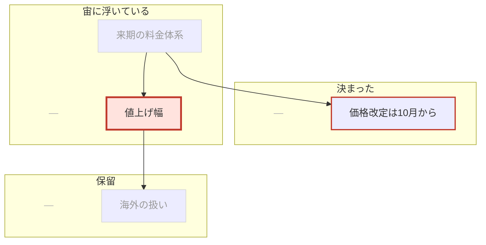
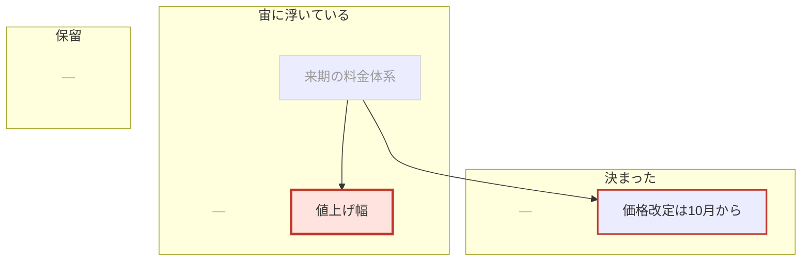
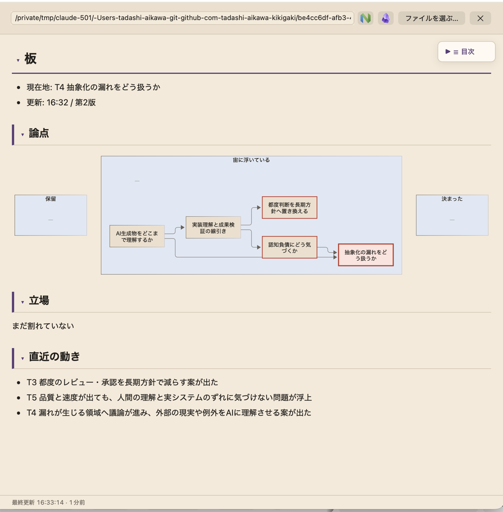
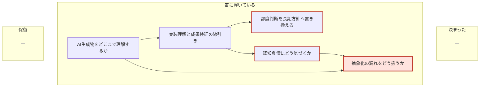

# 議論のホワイトボード(第1段の試作)

会話の現在地を文字以上の形で見せる「板」を、**アプリのコードを1行も変えずに**試すための記録。既存の[定期自動送信](ai-scheduled.md)がAIへ依頼を投げ、AIが1枚のMarkdownを描き直し、[議事録プレビュー](minutes-rendering.md)がMermaidごと自動で映す。板の型と `autoPrompt` だけが成果物であり、Swift側の追加は無い。

議事録との違いは目的にある。議事録は経緯を残す記録で、後から読む人のためにある。板は「いま何の話をしていて、どこが決まっていて、誰と誰が割れているか」を会議の最中に見せるもので、古い話は薄くなるか消えてよい。

## 板の型

4つのブロックを決まった順で並べる。1画面に収めるため、論点は12個、立場の表は割れている論点だけ、直近の動きは3行までに抑える。

````markdown
# 板
- 現在地: T3 値上げ幅
- 更新: 14:32 / 第4版

## 論点



## 立場

| 論点 | タダシ | 田中 |
| --- | --- | --- |
| T3 値上げ幅 | 10%まで | 5%が上限 |

## 直近の動き

- T3 が新しく立った
- T2 が決まった
````

型が担うもの:

- **論点の地図**: 矢印が派生関係、`now` の1ノードが現在地
- **決まった / 宙に浮いている / 保留**: 3つのsubgraphが場所を分ける。状態が変わるとノード行が別のsubgraphへ移る
- **立場の分布**: 表。人をMermaidのノードにすると辺が増えて配置が毎回変わるため、図には入れない
- **鮮度**: `hot` が直前の版で動いた論点、`cold` が2版以上動いていないもの。既定は無印

### 1画面に収める書き方

`flowchart TB` と subgraph内の `direction LR` の組み合わせは実測で選んだ。同じ内容を `flowchart LR` + `direction TB` で書くと、論点7個の時点で図が縦に伸びて「立場」と「直近の動き」が画面外へ出た。

各subgraphの先頭に置く `K0` `G0` `H0` の `—` も実測による。Mermaidは中身の無いsubgraphに枠を描かず、見出しの文字だけが宙に浮く。空でも場所が見えるよう置き石を1つ入れ、`slot` クラスで透明にして薄い罫だけ残す。

### レイアウトの跳ねを抑える工夫

Mermaidは同じ内容でも書き方が変わると配置が変わる。会議中に見る板では、前回どこを見ていたかが分からなくなるのが一番困るので、次の4点を型と `autoPrompt` の両方で縛る。

- **ノードIDの固定**: `T1` から初出順に採番し、一度付けたIDは変えない・消さない・再利用しない。論点の文言を書き直してもIDは保つ
- **行順の保存**: 既存行を並べ替えず、変わった行だけ書き換え、新しい行は末尾へ足す。毎回ゼロから組み直させない
- **subgraphの固定**: 名前・`direction LR`・置き石を変えない。状態の変化はノード行の移動だけで表す
- **鮮度はスタイル**: 色と線の太さで示す。`classDef` は[対応記法](minutes-rendering.md#対応記法)のMermaidブロックでそのまま通り、ノードの位置に影響しない

これでもノードの並びは固定できない。理由と実測は「[分かった限界](#分かった限界)」に書く。

## autoPrompt

`[[ai]]` の `autoPrompt` にそのまま貼れる形。TOMLでは `'''` のリテラル複数行文字列に入れる。`${yyyyMMdd_HHmmss}` はこのプロンプト内だけの約束で、アプリは展開しない。

````text
議論のホワイトボードを描き直してください。議事録ではなく「いま何を話しているか」を1画面で見せる板です。経緯の記録ではなく現在地の可視化が目的です。

書き先は `participant.minutes_path`。無ければ ~/Documents/boards/${yyyyMMdd_HHmmss}.md を作り、変数は録音開始の日時。既にある板は必ず読んでから書き換えます。

型はこの4ブロックと順序を必ず守ります。

# 板
- 現在地: <ID> <論点名>
- 更新: <HH:MM> / 第<n>版

## 論点



## 立場

| 論点 | タダシ | 田中 |
| --- | --- | --- |
| T3 値上げ幅 | 10%まで | 5%が上限 |

## 直近の動き

- T3 が新しく立った
- T2 が決まった

規則:

- ノードIDは T1 から初出順に採番する。一度付けたIDは変えない・消さない・再利用しない。論点の文言を書き直してもIDは保つ
- 既存の板の行の順序を保ち、並べ替えない。変わった行だけを書き換え、新しい行は末尾へ足す。毎回ゼロから組み直さない。図の配置が跳ねると読み手が現在地を見失うため
- 論点は3つのsubgraphのどれか1つに置く。状態が変わったらノード行を別のsubgraphへ移す。subgraphの名前と `direction LR`、`K0` `G0` `H0` の `—` は消さない。空のsubgraphでも枠を描かせるための置き石で、`slot` クラスで薄く隠す
- `flowchart TB` と subgraph内の `direction LR` は変えない。この組み合わせだけが3つの場所を横に並べ、板全体を1画面へ収める
- 派生関係は `T1 --> T3` の矢印で、subgraphの外に追加順で並べる
- ノードラベルは20字以内。必ず `["..."]` で囲む。ラベルに `[` `]` `"` を入れない
- 現在地はちょうど1つ。`class Tn now`
- 直前の版から内容・所属・立場が動いた論点に `class ... hot`、2版以上動いていない論点に `class ... cold` を付ける。now / hot / cold を同じIDへ重ねない
- 立場の表は意見が割れている論点だけ書く。全員一致と未表明は書かない。話者名は会話の話者名のまま、値は10字以内の立場。割れている論点が1つも無ければ表を省き、「まだ割れていない」の1行だけ置く
- 直近の動きは3行まで。古い行は消す
- 論点は12個までに保つ。決着して2版以上動かないものは畳むか保留へ移す
- 会話に無い論点・立場を足さない。聞き取れない箇所は書かない。話者の取り違えがあり得るので、立場が読めないときは表へ書かない

板の保存に成功したら kikigaki-cli の minutes で板の絶対パスを通知し、answeredは「第n版: 動いた点」の1〜2行だけにしてください。標準出力での報告は不要です。
````

返送は既存契約のままで足りる。AIは[会議参加モード](../skills/kikigaki/references/meeting.md)の手順どおりに `accept` → `progress --editing` → 板の保存 → `minutes --path <板の絶対パス>` → `progress --replying` → `reply --kind answered` と返す。`minutes` の通知で右ペインの表示対象が板へ切り替わるため、初回だけ人が板を開く操作も要らない。

## 設定例

タダシの `~/.config/kikigaki/config.toml` へ足す形。既存プロファイルは消さず、末尾に1つ増やす。宛先ポップアップで「板」を選ぶと使える。

```toml
[[ai]]
name = "板"
cli = "codex"
model = "gpt-6-astra"
effort = "medium"
address = "クロディーヌへ"
cwd = "~/work/owlery"
notifySound = false
autoIntervalMinutes = 1
avatar = "~/work/owlery/shared/images/members/claudine-face.webp"
autoPrompt = '''
(上のautoPromptをそのまま貼る)
'''
```

- `autoIntervalMinutes = 1` が最短。板は「いま」を映すものなので既定の3分では追随しない
- 議事録プロファイルと**同時に使える**。手動と自動は宛先を別々に覚えるので、自動を「板」、手動を議事録のプロファイルにすると、板が回りながら必要なときだけ議事録を書かせられる
- 板を毎回同じファイルへ描かせたいときは、録音開始シートの議事録欄でそのパスを指定する。`participant.minutes_path` として渡り、`autoPrompt` の既定パスより優先される
- `autoStart = true` を付けると録音開始と同時に板が回り始める。付けるのは1プロファイルまで

書き先は `cli` の権限の外に置かないほうが楽に回る。

- Codexは保存先 `outputDir` が無条件に書き込み許可へ入るため、`~/Documents/KIKIGAKI/boards/` のように保存先の下へ置けば承認を挟まない。検証もこの形で通した
- Claudeはcwdの外の編集が承認待ちになり、herdrのペインでblockedとして見える。`cli = "claude"` にするなら、板の置き場を `cwd` の下にするか、ペインで一度承認する。`autoPrompt` の中身はCLIによらず同じ

## 検証結果

replayで端から端まで通した。Swiftのコードは1行も変えていない。

- 素材: `2026-09-14_0044.wav`。4人パネル討論の18分40秒。10倍速のreplay
- 宛先: Codex `gpt-6-astra` medium。`cwd` と保存先を作業用ディレクトリへ隔離し、タダシの `~/.config/kikigaki/config.toml` と `~/Documents/KIKIGAKI/` は触っていない
- 起動: `KIKIGAKI_DEBUG_AI_AUTO="45:<autoPrompt>"` と `KIKIGAKI_DEBUG_REPLAY_HOLD` で、実herdrと同梱CLIを使う `.app` から
- 送信: 通常tickで1回、録音停止時の最後の1回で1回。どちらもansweredで返った

確認できたこと:

- **板が型どおりに作られ、型どおりに更新された。** 第1版は論点2個、第2版は5個。`# 板` / `## 論点` / `## 立場` / `## 直近の動き` の4ブロックと順序は両版とも守られた
- **ノードIDが保たれ、行が追記で伸びた。** 第2版の差分は、既存の `T1` `T2` の行をそのまま残し、`T3` `T4` `T5` の行と矢印3本を末尾へ足しただけだった。`class` 行だけが書き換わった
- **鮮度と現在地が動いた。** 現在地が `T2` から `T4` へ移り、`hot` が `T1` から `T3,T5` へ移った
- **議事録ペインがMermaidごと描画した。** `classDef` の色、3つのsubgraphの枠、`slot` の透明化がすべて効いた
- **`minutes` 通知で表示対象が板へ切り替わった。** `ai/minutes.json` が `target_source: "ai"`、`revision: 2` で板の絶対パスを指していた
- **録音停止後の後片付けでherdrのペインが閉じた。** 最後の1回の返事まで待ってから閉じている

第2版を議事録ペインで描いたもの:



板の中身(第2版):

````markdown
# 板
- 現在地: T4 抽象化の漏れをどう扱うか
- 更新: 16:32 / 第2版

## 論点



## 立場

まだ割れていない

## 直近の動き

- T3 都度のレビュー・承認を長期方針で減らす案が出た
- T5 品質と速度が出ても、人間の理解と実システムのずれに気づけない問題が浮上
- T4 漏れが生じる領域へ議論が進み、外部の現実や例外をAIに理解させる案が出た
````

確認できていないこと:

- **3版以降**。10倍速のreplayでは18分の会議が約2分に縮み、AIの往復に60〜90秒かかるため2版までしか回らなかった。実時間の会議で `autoIntervalMinutes = 1` なら版はもっと増える
- **`cold` の表示**。2版では「2版以上動いていない論点」が生まれず、薄い色が実際に付くところまでは見ていない
- **立場の表**。この素材は討論だが対立が明示されず、AIは2回とも「まだ割れていない」と判断した。表の列がずらりと並んだときの見た目は未確認
- **論点が12個に達したとき**と、**subgraph間を論点が移動するとき**の見え方
- **狭いペイン幅**。ウィンドウ1500ptでの確認で、720pt前後まで詰めたときの折り返しは見ていない

## 分かった限界

**Mermaidのノードの並びは固定できない。** IDと行順を保っても、辺が1本増えるとdagreが全体を組み直す。最初の型は `flowchart LR` + subgraph内 `direction TB` にしていたが、論点7個で図が縦に伸び、「立場」と「直近の動き」が画面外へ出た。`flowchart TB` + `direction LR` と置き石に替えて1画面へ収めたものの、subgraphの左右の並びは宣言順どおりにならない。実測では `保留` / `宙に浮いている` / `決まった` の順に並び、宣言順の `K` → `G` → `H` とは違った。読み手が場所を見失わないのは各枠に名前が書いてあるからで、位置は当てにできない。

**1〜2分の遅れは消せない。** 送信間隔の最短が1分、AIの往復が60〜90秒なので、板は常に「少し前の会議」を映す。返事待ちの間のtickはスキップされるため、実質の更新周期は間隔ではなくAIの応答時間で決まる。

**録音開始直後の1回は落ちることがある。** 1回目のreplayでは初回送信が `agent_not_ready` で失敗した。CodexのCLIが起動しきる前にtickが来たためで、次の期限で回復した。`autoIntervalMinutes = 1` なら1分の遅れで済む。

**会議Markdownが `autoPrompt` で膨らむ。** 送信ごとに問いの全文が `## AIとのやりとり` の「送信文」へ1行で入る。板のプロンプトは1600字ほどあるので、10回送ると会議Markdownの大半がプロンプトの写しになる。

**板は会議Markdownの外にある。** AIが書くのは指定した1ファイルだけで、録音を消しても板は残り、板を消しても会議Markdownは残る。世代管理も無い。前の版へ戻す手段は無く、AIが型を崩した版で上書きすると戻せない。

**AIが会話を読み違える余地はそのまま。** 話者判別の誤りと音声認識の誤字はそのまま板の論点名と立場に入る。板は会議の要約であって議事録の代わりではない。

## 第2段への示唆

- **図の配置の固定はアプリ側でしかできない。** Mermaidに任せるかぎり跳ねる。論点の位置を人が動かせて、次の版でもその位置を引き継ぐ専用ペインが要る。第1段の板はその仕様を決めるための素材として使う
- **鮮度は濃淡でなく時間で持つ。** いまは `hot` / `cold` の2段をAIが毎回判定している。アプリが版ごとの更新時刻を持てば、AIは「何が動いたか」だけを書けばよく、薄くする処理は表示側で連続的にできる
- **プロンプトを会議Markdownから外す。** 板のような長い定型の問いは、送信文の全文ではなくプロファイル名だけを残したい。`autoPrompt` を送信文とは別枠で扱えるようにする案
- **更新周期はAIの応答時間で決まる。** 間隔を短くするより、板の差分だけを返させて往復を短くするほうが効く
- **まず実会議で1回試す。** ここで確かめたのは型が守られることと描けることだけで、板が会議の役に立つかは別の話
